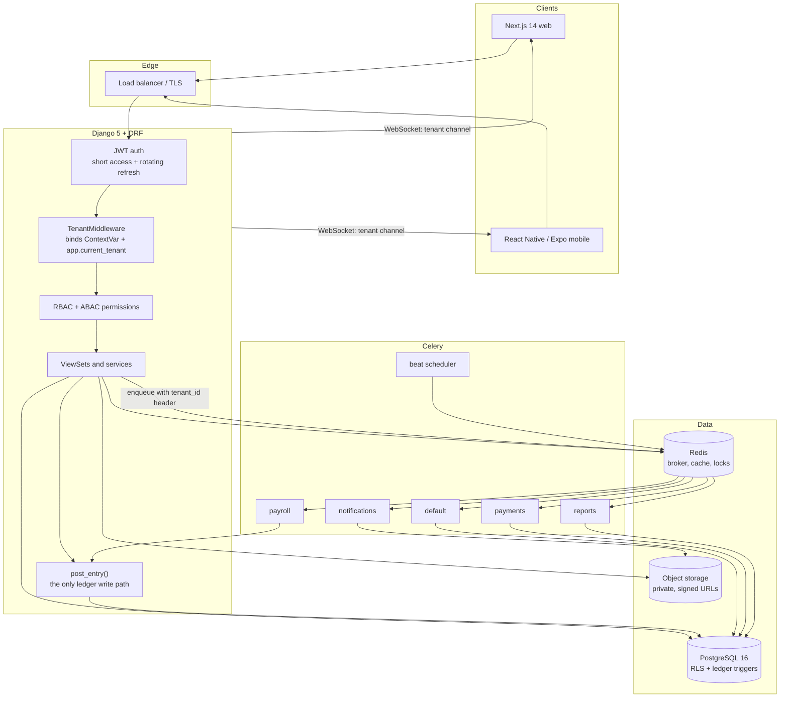

# ERP — Multi-tenant Accounting & HR Platform

A production-grade, multi-tenant **accounting + HR/payroll ERP**: a
double-entry general ledger with sales, purchasing, payments, inventory,
banking, projects, HR and payroll built on top of it, served to a Next.js web
app and a React Native mobile app through a versioned REST API.

It is designed for the case that makes most ERPs fall over: **many customer
organisations sharing one database, each of which is legally required to be
able to prove its books are correct and untouched.** Every architectural
decision in this repository traces back to that sentence.

---

## What it is

- **Double-entry general ledger.** Every financial event in every module —
  an invoice, a stock movement, a payslip — is expressed as a balanced journal
  entry. There is exactly one write path into the ledger.
- **Multi-tenant by row, isolated by the database.** One schema,
  `tenant_id` on every business row, PostgreSQL Row-Level Security enforcing it
  below the ORM.
- **Immutable financial history.** Posted documents are never edited or
  deleted. Corrections are voids and reversals, and they are visible.
- **RBAC + ABAC.** "May this user post a journal entry?" and "for which
  department?" are separate, composable questions.
- **Arabic/English, RTL-aware, multi-currency, multi-fiscal-calendar.**

## Module map

| Module | App | Owns |
|---|---|---|
| Core | `apps.core` | Abstract bases, `MoneyField`/`Decimal` primitives, tenancy `ContextVar`, cache/log/throttle plumbing |
| Tenancy | `apps.tenancy` | `Tenant`, domains, subscriptions, audit log, **the RLS migration** |
| Identity & access | `apps.iam` | Users, memberships, roles, permissions, ABAC scope rules, API keys |
| Accounting | `apps.accounting` | Chart of accounts, fiscal calendar, journals, **the ledger and the posting engine**, tax and FX rates, gapless numbering |
| Sales | `apps.sales` | Customers, invoices, credit notes, recurring invoices, dunning |
| Payments | `apps.payments` | Payments, applications, refunds, gateway webhooks |
| Expenses | `apps.expenses` | Employee expenses, vendor bills |
| Inventory | `apps.inventory` | Items, stock levels, movements, COGS postings |
| Banking | `apps.banking` | Bank accounts, statement import, reconciliation |
| Projects | `apps.projects` | Projects, timesheets, WIP and profitability |
| HR | `apps.hr` | Employees, departments, attendance, leave |
| Payroll | `apps.payroll` | Payroll runs, payslips, statutory contributions, GL postings |
| Reporting | `apps.reporting` | Trial balance, P&L, balance sheet, cash flow, AR/AP aging, VAT return — *scaffolded in `INSTALLED_APPS`; implementation lands in Phase 3* |

## Stack

| Layer | Choice |
|---|---|
| API | Django 5 + Django REST Framework, SimpleJWT (short access, rotating refresh, blacklist) |
| Database | PostgreSQL 16 — `numeric` money, Row-Level Security, PL/pgSQL ledger triggers |
| Async | Celery + Redis, five queues (`default`, `payments`, `payroll`, `reports`, `notifications`), beat schedule |
| Realtime | Django Channels over Redis, per-tenant WebSocket channels |
| Web | Next.js 14 (App Router) + TypeScript, TanStack Query, Zustand, React Hook Form + Zod |
| Mobile | React Native / Expo + TypeScript, offline outbox with idempotency keys |
| Contract | OpenAPI 3.1 via drf-spectacular → generated TS types and Zod schemas |
| Observability | structlog JSON logs with tenant/request correlation, Sentry, Prometheus |

## Architecture

A request arrives at the API, is authenticated, and the tenant middleware
resolves the caller's active tenant from their membership. It binds that tenant
in two places at once: a `ContextVar` that the ORM's default manager reads, and
the PostgreSQL session variable `app.current_tenant` (via
`set_config(..., is_local => true)`, so it dies at COMMIT and cannot survive
into another request through a pooled connection). From that point, application
code cannot address another tenant's rows even by accident: the ORM filters
them and, underneath, RLS policies with both `USING` and `WITH CHECK` clauses
refuse to read *or write* them. Business modules never touch the ledger
directly — they build a `JournalEntryDraft` and hand it to
`post_entry()`, the single choke point where the period lock, FX conversion,
idempotency key and the debits-equal-credits rule are enforced. Those same
invariants are then enforced a second time in PL/pgSQL triggers, because the
Python layer is a convention and the database is a guarantee. Long or
repeated work (payroll runs, gateway calls, nightly integrity checks) goes to
Celery, where each task re-binds the tenant from message headers and is
idempotent, because `acks_late` gives at-least-once delivery. Clients receive
money as decimal **strings** and never do arithmetic on it as a JS number.



---

## The non-negotiable engineering rules

Each rule is one line, followed by the failure it prevents.

1. **Money is `Decimal`/`numeric(19,6)` end to end; `float` is forbidden,
   including in JSON.**
   *Prevents:* `0.1 + 0.2 = 0.30000000000000004` breaking the trial balance by
   fractions of a cent that nobody can locate or explain.

2. **Every financial effect is a balanced double entry, written only through
   `post_entry()`, and `SUM(debit) = SUM(credit)` is enforced by a deferred
   constraint trigger.**
   *Prevents:* a module posting one side of a transaction and leaving the books
   permanently out of balance — undetectable until an auditor finds it.

3. **Posted documents are immutable: no UPDATE of monetary columns, no DELETE,
   nothing into a closed period. Corrections are reversals.**
   *Prevents:* a historical figure that has already been reported to a tax
   authority silently changing, with no record that it ever differed.

4. **Tenant isolation is enforced by the database (RLS with `FORCE`, `USING`
   *and* `WITH CHECK`), with the app connecting as a non-owner, non-superuser
   role — not by remembering to add `.filter(tenant=...)`.**
   *Prevents:* one customer reading — or silently writing into — another
   customer's books via a raw query, a forgotten filter, or a Celery task that
   never bound a tenant.

5. **Every externally-triggered or retryable write carries an idempotency key
   enforced by a unique constraint.**
   *Prevents:* an at-least-once Celery redelivery or a replayed gateway webhook
   posting the same payroll run, payment or invoice twice.

6. **Document numbers come from a locked counter row, never a sequence.**
   *Prevents:* gaps in an invoice sequence, which tax authorities read as
   evidence of deleted invoices.

---

## Repository layout

```
.
├── README.md
├── CONVENTIONS.md                     binding model-layer contract
├── Makefile                           every developer/CI entry point
├── docker-compose.yml                 postgres 16, redis 7, api, workers, beat
├── backend/
│   ├── manage.py
│   ├── config/
│   │   ├── settings/{base,dev,prod}.py
│   │   ├── celery.py                  queues, routing, beat schedule
│   │   ├── urls.py                    versioned router, health, OpenAPI
│   │   ├── asgi.py  wsgi.py
│   ├── requirements/{base,dev,prod}.txt
│   └── apps/
│       ├── core/          fields.py models.py tenancy_context.py middleware.py
│       ├── tenancy/       models.py middleware.py migrations/0002_row_level_security.py
│       ├── iam/           models.py permissions.py services/abac.py
│       ├── accounting/    models.py models_sequence.py services/posting.py
│       │                  migrations/0002_ledger_guards.py
│       ├── sales/ payments/ expenses/ inventory/ banking/
│       ├── projects/ hr/ payroll/ reporting/
│       └── */{serializers,views,urls,tasks,tests}/
├── frontend/                          pnpm workspace (Phase 4/5)
│   ├── apps/{web,mobile}/
│   └── packages/{domain,api-client,ui}/
├── infra/
│   ├── docker/Dockerfile
│   ├── postgres/init/                 role creation: erp_migrator, erp_app
│   └── k8s/
├── scripts/                           one-off operational scripts
└── docs/                              the specifications (see index below)
```

## Quick start

```bash
git clone <repo> && cd erp

# 1. Bring up postgres 16 + redis 7 + api + workers + beat
make up

# 2. Apply schema, RLS policies and ledger triggers (runs as the OWNER role)
make migrate

# 3. Permissions, system roles, and two demo tenants with a chart of accounts
make seed

# 4. A platform admin login
make superuser
```

| URL | What |
|---|---|
| http://localhost:8000/api/v1/ | API root |
| http://localhost:8000/api/schema/docs/ | Swagger UI |
| http://localhost:8000/healthz · `/readyz` | liveness · readiness |
| http://localhost:5555 | Flower (`make up` with `--profile tools`) |
| http://localhost:8025 | Mailpit |

Day to day:

```bash
make run          # dev server on :8000
make worker       # general Celery worker
make beat         # scheduler — run exactly one
make test         # pytest, parallel, coverage gate at 85%
make lint         # ruff check + format --check
make typecheck    # mypy + django-stubs
make schema       # regenerate the OpenAPI schema the TS clients are built from
make check        # everything CI runs
make rls-verify   # assert FORCE ROW LEVEL SECURITY on every tenant table
```

> **Never run the application as a PostgreSQL superuser or as the table owner.**
> RLS is bypassed by both unless `FORCE ROW LEVEL SECURITY` is set. `make
> migrate` uses `erp_migrator` (owner); everything else uses `erp_app`
> (non-owner, no `BYPASSRLS`). This is the single most common way a team
> silently disables its own tenant isolation.

---

## Delivery roadmap

| Phase | Scope | Status |
|---|---|---|
| **Phase 1 — Foundations** | Full data model for all 13 apps; money/decimal primitives; tenancy context + RLS policies; RBAC + ABAC model; the **ledger posting engine**; the **payroll calculation engine**; gapless numbering; ledger guard triggers; written specifications for every module | ✅ **Delivered** |
| **Phase 2 — API surface** | DRF serializers, viewsets, filters and permissions for every module; OpenAPI schema; idempotency middleware; the test suite (pytest + factory-boy + hypothesis on the money layer) | 🔜 Next |
| **Phase 3 — Reporting & integrations** | Reporting engine (trial balance, P&L, balance sheet, cash flow, AR/AP aging, VAT return, payroll register); Stripe and bank-feed integrations; statement import and reconciliation; scheduled exports | Planned |
| **Phase 4 — Web application** | Next.js 14 app per `docs/07-frontend-architecture.md`: generated types, `Money` type, TanStack Query with tenant-first keys, invalidation map, Arabic/RTL | Planned |
| **Phase 5 — Mobile application** | Expo app: attendance with GPS, expense capture, approvals, cached payslips, the offline outbox with client-generated idempotency keys, biometric unlock | Planned |

---

## Documentation index

Everything under `docs/`. Specifications are normative: where a spec and the
code disagree, one of them is a bug.

| Document | Covers | Status |
|---|---|---|
| [`docs/01-technical-requirements.md`](docs/01-technical-requirements.md) | Technical requirements: scope, functional modules, non-functional targets, compliance constraints | ✅ Written |
| [`docs/02-architecture.md`](docs/02-architecture.md) | Tiers, request lifecycle, tenant resolution, async topology, deployment shape | ✅ Written |
| [`docs/03-data-model.md`](docs/03-data-model.md) | Every persistent entity, its key columns, constraints and indexes | ✅ Written |
| [`docs/04-state-machines.md`](docs/04-state-machines.md) | Every state machine (invoice, payment, journal entry, fiscal period, payroll run, leave, expense, timesheet) with transition tables, guards and GL sequence diagrams | ✅ Written |
| [`docs/05-permission-matrix.md`](docs/05-permission-matrix.md) | Roles, permission codenames, ABAC scope rules. Machine-readable source: `backend/config/permissions.json` | ✅ Written |
| [`docs/06-api-contract.md`](docs/06-api-contract.md) | REST conventions, every endpoint and the permission codename it requires | ✅ Written |
| [**`docs/07-frontend-architecture.md`**](docs/07-frontend-architecture.md) | **Web + mobile blueprint: monorepo, the client money rule, TanStack Query keys and invalidation, optimistic-update policy, offline outbox, realtime, auth, RTL, testing** | ✅ **Written** |
| [`docs/08-testing-strategy.md`](docs/08-testing-strategy.md) | Testing pyramid, what must have a test before it ships, property-based testing for money, invariants guarded per file | ✅ Written |
| [`docs/09-verification-report.md`](docs/09-verification-report.md) | **What was actually executed and passed**: static checks, `manage.py check`, migrations against live PostgreSQL 16, 31 runtime invariant tests, and the known gaps | ✅ Written |
| [**`docs/11-general-ledger.md`**](docs/11-general-ledger.md) | **The general ledger: the 5-level coded chart, the server-side coding scheme, the English default chart, add-account, the manual-journal lifecycle, the four core reports, and the frontend screens** | ✅ **Written** |
| [`docs/diagrams/erd.md`](docs/diagrams/erd.md) | Seven Mermaid ER diagrams: tenancy/IAM, accounting, sales/payments/expenses, inventory/banking, projects, HR/payroll, and the cross-domain bridges | ✅ Written |
| `docs/10-deployment-and-operations.md` | Environments, migrations under load, pgbouncer, backups, restore drills, runbooks | Planned |
| `docs/10-testing-strategy.md` | Test pyramid, tenant-isolation tests, property-based money tests, E2E journeys | Planned |
| [`docs/diagrams/erd.md`](docs/diagrams/erd.md) | Entity-relationship diagrams, split into six readable subject areas | ✅ Written |

Also normative, outside `docs/`:

- [`CONVENTIONS.md`](CONVENTIONS.md) — the binding contract every
  `apps/*/models.py` follows: base classes, money fields, required `Meta`
  constraints and indexes, status transitions, deletion policy, naming.
