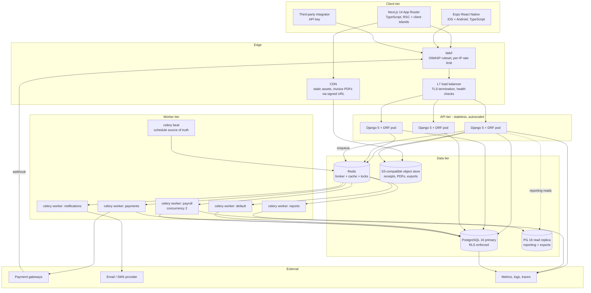
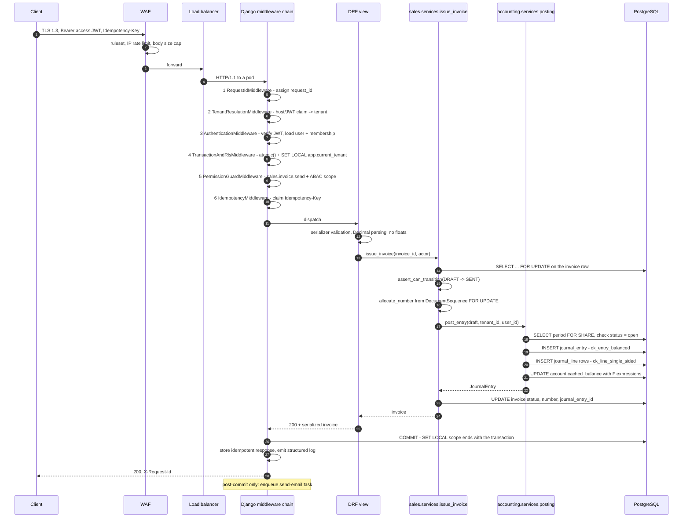

# 02 — Architecture Blueprint

**Scope:** the shape of the running system — tiers, request lifecycle, async topology,
caching, storage, observability, deployment, disaster recovery, and the architectural
decisions with their consequences.

**Companion documents:** `01-technical-requirements.md` (what must be true),
`03-data-model.md` (persistent state), `04-state-machines.md` (lifecycles),
`CONVENTIONS.md` (structural contract for model code).

---

## 1. Architectural stance in one paragraph

One PostgreSQL database, one schema, `tenant_id` on every business row, Row-Level
Security as the enforcement floor. A stateless Django/DRF API tier that resolves the
tenant once per request and binds it to both a `ContextVar` (for the ORM) and a
PostgreSQL session variable (for RLS). A Celery worker tier with per-domain queues so
that a slow payroll run cannot starve invoice emails. A general ledger that only one
function may write to. Everything else is an implementation detail that can be changed
without changing the books.

---

## 2. C4-ish layered view

### 2.1 Container diagram



### 2.2 Tier responsibilities

| Tier | Owns | Explicitly does not own |
|---|---|---|
| **Client** | Rendering, optimistic UI, input masking, locale/RTL presentation | Authorisation decisions, money arithmetic, tenant selection |
| **Edge** | TLS, WAF rules, coarse rate limiting, static/CDN delivery | Business logic, tenant resolution |
| **API** | Tenant resolution, authentication, RLS binding, permission checks, request validation, orchestration of services, transaction boundaries | Long-running work, retries against third parties, report aggregation |
| **Worker** | Anything slow, retryable, or scheduled: payroll, reports, PDFs, webhooks, emails, imports, nightly integrity jobs | Being the only place a rule is enforced (rules live in services shared with the API) |
| **Data** | Durability, isolation (RLS), constraint enforcement, sequences, backups | Business rules that need context beyond a row |

**Layering rule inside the API tier**, in strict dependency order:

```
views/serializers  ->  services/  ->  models/  ->  database
       (HTTP)         (business)     (state)     (constraints)
```

A view never touches the ORM for a write. A service never imports DRF. A model holds
invariants and transitions only (`CONVENTIONS.md` §9). The general ledger is written by
exactly one function, `apps.accounting.services.posting.post_entry()`; every other
module produces a `JournalEntryDraft` via `build_journal_entry()` and hands it over.
This is the choke point where `sum(debits) == sum(credits)` is verified once instead of
twelve times.

---

## 3. Request lifecycle — an authenticated write

Walking `POST /api/v1/invoices/{id}/send` end to end.



### 3.1 The middleware chain, in order

| # | Middleware | Responsibility | Output it puts in scope |
|---|---|---|---|
| 1 | `RequestIdMiddleware` | Accept or mint `X-Request-Id`; bind it to the logging context | `request_id` |
| 2 | `TenantResolutionMiddleware` | Resolve tenant from host header (`TenantDomain`) or subdomain (`Tenant.slug`), then cross-check against the JWT's tenant claim | `request.tenant` (unverified-by-auth at this point) |
| 3 | `AuthenticationMiddleware` | Verify the JWT signature/expiry, load `User`, load the **active** `TenantMembership` for the resolved tenant, reject if missing or inactive | `request.user`, `request.membership` |
| 4 | `TransactionAndRlsMiddleware` | Open `transaction.atomic()` for unsafe methods, then `bind_database_session(tenant_id)` → `SET LOCAL app.current_tenant`, and set the `ContextVar` via `tenant_context()` | Bound DB session + ORM context |
| 5 | `PermissionGuardMiddleware` | Derive the required `Permission` codename from the view's `resource` + HTTP method; check the membership's `RoleAssignment`s; compile `ScopeRule` into the queryset `Q` | `request.scope_q` |
| 6 | `IdempotencyMiddleware` | For unsafe methods with an `Idempotency-Key`, claim `(tenant_id, key)`; replay the stored response on a repeat | Replay or pass-through |
| 7 | `AuditContextMiddleware` | Stash actor/IP/user-agent for `TenantAuditLog` writers | Audit context |

### 3.2 Why exactly this order — and what breaks at each swap

| Swap | What breaks |
|---|---|
| **1 ↔ 2** (request id after tenant) | The tenant-resolution failure path — the most security-relevant rejection you have — logs without a correlation id, so you cannot join it to the client's report or to the WAF log. Request id must be first because it is the only thing every subsequent line needs. |
| **2 ↔ 3** (auth before tenant) | Authentication would have to *guess* which tenant's membership to load, and the natural fix is to trust a client-supplied `X-Tenant-Id`. That is tenant impersonation by header. Tenant must be resolved from the routable identity (host/subdomain) and the JWT claim, then auth confirms the actor is a member of *that* tenant. |
| **3 ↔ 4** (RLS binding before auth) | You would bind the database session to a tenant derived from an unauthenticated request. Any auth bug downstream becomes a data-read bug, because the connection is already trusting a tenant. Bind only what auth has confirmed. |
| **4 ↔ 5** (permission check before RLS binding) | The permission check itself reads `RoleAssignment`, `Role`, `ScopeRule` — tenant-scoped rows. Without the binding, `TenantManager.get_queryset()` returns `.none()` and every request 403s; if someone "fixes" that by using `all_tenants`, the permission check now reads across tenants. Also: a check performed outside the transaction can be invalidated by a concurrent role revocation before the write commits. |
| **4 after the view** | `SET LOCAL` is transaction-scoped by design (`bind_database_session` passes `is_local=true`). If the transaction opens after the binding, the binding is discarded. Worse, on a pooled connection a session-scoped `SET` would leak the previous request's tenant to the next request — the exact cross-tenant leak RLS exists to prevent. The atomic block must wrap the binding, and the binding must precede any query. |
| **5 ↔ 6** (idempotency before permission) | An unauthorised caller could burn idempotency keys, and a replayed response could be served to someone who is no longer permitted to see it. Authorise, then deduplicate. |
| **6 inside the view** | Every view author has to remember it. Idempotency is a transport concern; it belongs in the transport layer. |
| **Enqueueing Celery inside the transaction** | The classic dual-write bug: the task starts, reads the row, and the row is not there yet (or the transaction rolls back and the email goes out for an invoice that does not exist). All enqueues go through `transaction.on_commit()`. |

### 3.3 The two-layer tenant guard

```
ORM layer   : TenantManager.get_queryset() filters tenant_id, .none() when unbound
DB layer    : RLS policy USING (tenant_id = current_setting('app.current_tenant')::uuid)
```

Both, not either. The ORM layer produces clean errors and good query plans and covers
99% of code. RLS is what still holds when a developer writes `.raw()`, a Celery task
forgets `tenant_context()`, a management command runs at 2 a.m., or an analyst opens
psql. The application database role must **not** be `BYPASSRLS` and must not own the
tables, or the policies are decoration.

`platform_admin_context()` sets `app.rls_bypass = on`, which the policies read as an
escape hatch. Every use is audit-logged (`TenantAuditLog.IMPERSONATION`), MFA-gated,
and time-boxed.

---

## 4. Celery topology

### 4.1 Queues

| Queue | Work | Concurrency | Priority | `acks_late` | Rate limits |
|---|---|---|---|---|---|
| `default` | Everything unclassified: cache warms, small recalcs, cleanup | 8 per worker, 2–8 workers | normal | yes | — |
| `payments` | Webhook processing, gateway captures/refunds, settlement reconciliation | 4 per worker, 2–6 workers | **high** | yes | per-gateway token bucket |
| `payroll` | Payroll calculation, payslip PDFs, payroll posting, bank file generation | **2 per worker, 1 worker per tenant-shard** | normal | yes | 1 concurrent run per tenant (Redis lock) |
| `reports` | Report materialisation, exports, cash-flow forecast, nightly aggregates | 4, autoscaled | **low** | yes | reads go to the replica |
| `notifications` | Email, SMS, push, in-app | 16 (IO-bound) | normal | yes | provider-imposed |

### 4.2 Why payroll gets its own queue and its own concurrency limit

Four independent reasons, any one of which would justify it:

1. **Blast radius.** A 500-employee payroll run holds row locks on employees, salary
   structures and the payroll journal for tens of seconds. On a shared queue it would
   sit behind — and in front of — invoice emails. Isolating it means a payroll problem
   is a payroll problem.
2. **Contention shape.** Payroll writes one very large journal entry and touches many
   `Account.cached_balance` rows with `F()` updates. Two concurrent payroll runs for
   the same tenant serialise on those rows anyway; running them in parallel just
   converts throughput into lock waits and deadlock retries. Concurrency 2 (with a
   per-tenant Redis lock making it effectively 1 per tenant) turns implicit contention
   into explicit queueing.
3. **Memory profile.** Payroll materialises every employee's components and snapshot.
   It is the highest-memory task in the system. Sharing a worker process pool with
   16 notification tasks means the OOM killer chooses for you, and it will choose the
   biggest process — the payroll run.
4. **Operational blast-radius control.** Payroll is monthly, deadline-bound, and legally
   sensitive. When it is late, you want to scale exactly it, pause exactly it, and
   alert on exactly its queue depth. You cannot do any of that if it shares a queue.

The same reasoning, more weakly, gives `payments` its own queue: webhook latency is
externally observed (gateways retry and eventually disable endpoints), so it must never
queue behind a 10-minute export.

### 4.3 Task contract

Every task obeys:

* **Arguments are ids and primitives**, never ORM objects — a serialised model is a stale
  model, and it also smuggles a row across the tenant boundary.
* **First thing it does is bind context**: `with tenant_context(tenant_id, user_id):` and,
  inside the transaction, `bind_database_session(tenant_id)`. A task without this is
  invisible to the ORM manager (`.none()`) and blocked by RLS. That is a deliberately
  loud failure.
* **`acks_late = True`** plus idempotency, so a killed worker re-runs safely.
* **Bounded retries** with exponential backoff and jitter; a dead-letter queue after the
  cap, never an infinite retry loop.
* **`transaction.on_commit()`** at the enqueue site, always.
* **`request_id` and `tenant_id` propagate** into the task's log context via task headers.

### 4.4 Beat schedule (the recurring spine)

| Schedule | Task | Queue |
|---|---|---|
| every 5 min | Process parked/failed webhook events | `payments` |
| every 15 min | Gateway settlement polling (belt-and-braces vs webhooks) | `payments` |
| hourly | Recurring invoice generation sweep (fan-out one task per tenant) | `default` |
| nightly 01:00 tenant-local | **`assert_ledger_balanced()` per tenant** | `reports` |
| nightly 01:15 | Document-sequence gap check | `reports` |
| nightly 01:30 | Inventory valuation vs GL reconciliation | `reports` |
| nightly 02:00 | 13-week cash forecast rebuild | `reports` |
| nightly 02:30 | Leave accrual + carry-over expiry | `default` |
| daily 07:00 tenant-local | Overdue invoice reminders, document expiry reminders | `notifications` |
| weekly | Retention job dry-run report | `default` |

The nightly trial-balance job is the system's smoke alarm. Because the database
constraints make an unbalanced *entry* impossible, a failure means data arrived in the
ledger without going through `post_entry()` — a restore, a migration, or a manual SQL
fix. That is a P1 page, not a ticket.

---

## 5. Idempotency strategy

Three surfaces, one principle: **the caller names the operation; the server remembers
the name.**

### 5.1 HTTP

* Every unsafe request (`POST`/`PATCH`/`DELETE`) may carry `Idempotency-Key`. For
  money-moving endpoints it is **required**; the request is rejected `400` without it.
* Storage: `IdempotencyRecord(tenant_id, key, endpoint, request_hash, status,
  response_body, response_status, created_at)` with
  `UniqueConstraint(fields=["tenant", "key"])`.
* Flow: `INSERT ... ON CONFLICT DO NOTHING` to claim the key. Claimed → execute, then
  store the response in the same transaction. Already present and complete → replay the
  stored response with `Idempotency-Replayed: true`. Already present and in-flight →
  `409` with `Retry-After`.
* `request_hash` guards against the nastier failure: the same key with a *different*
  body is a client bug and returns `422`, not a silent replay of the wrong response.
* TTL 24 hours, then swept.

### 5.2 Webhooks

Store-then-process, unconditionally.

1. Verify the provider signature. Invalid → `400`, retain raw body 30 days, no enqueue.
2. `INSERT` a `WebhookEvent` row with `uq_webhook_provider_event(provider, provider_event_id)`.
   Conflict → return `202` immediately; it is a redelivery.
3. Return `202` in < 200 ms p95.
4. `on_commit` → enqueue processing on `payments`.
5. The processor is itself idempotent: it derives a business idempotency key
   (`f"payment:capture:{provider_event_id}"`) and hands it to `post_entry()`, which
   short-circuits on `uq_entry_idempotency`.

Why store first: the alternative — process synchronously and reply — couples your
webhook SLA to your database's worst case, and a timeout makes the gateway retry an
operation that may have already succeeded. Storing first makes the endpoint's only job
"durably remember this happened", which is the one thing it can do fast and reliably.
Out-of-order events (settlement before capture) are parked with a `pending_dependency`
status and retried, never dropped.

### 5.3 Tasks

* Every task takes an explicit `idempotency_key` argument or derives a deterministic one
  from its inputs.
* Ledger writes inherit the guarantee for free: `post_entry()` pre-checks
  `JournalEntry.idempotency_key` and returns the existing entry rather than raising, so
  a retried task is a no-op that still returns the right object. The unique index
  `uq_entry_idempotency` is the real guarantee; the pre-check is the fast path.
* Non-ledger side effects (send email, call gateway) are guarded by a Redis
  `SET key value NX EX ttl` lock plus a persisted "already sent" marker. Redis alone is
  not durable enough to be the record of an email that must not be sent twice.
* Sequence allocation is *not* idempotent by nature — so it happens inside the same
  transaction as the write it numbers, and a retry that finds the document already
  numbered skips allocation.

---

## 6. Caching

### 6.1 Layers

| Layer | Contents | TTL | Invalidation |
|---|---|---|---|
| CDN | Static assets, fonts, JS bundles | immutable, content-hashed | new hash on deploy |
| Signed-URL objects | Invoice/payslip PDFs, receipts | ≤ 15 min URL TTL | n/a — URL expiry is the control |
| Redis: config cache | Tenant settings, chart of accounts, tax rates, permission catalogue, role→permission map | 5–60 min | explicit bust on write |
| Redis: computed cache | Dashboard tiles, AR/AP ageing buckets, cash forecast | 5–15 min | version-bump on posting |
| Redis: rate limit + locks | Token buckets, per-tenant payroll lock | seconds–minutes | expiry |
| Per-request memo | Permission set, current membership, tenant row | request lifetime | discarded |

Never cached: anything derived from `JournalLine` that a report will show as a
period figure (FR-RPT-01), and anything containing salary detail.

### 6.2 The cache key rule — the one that must never be broken

**Every cache key begins with the tenant id. No exceptions. Ever.**

```
cache:v3:tenant:{tenant_id}:{domain}:{entity}:{identifier}[:{scope_hash}]
```

Enforced in code, not in convention:

```python
def tenant_cache_key(domain: str, *parts: str) -> str:
    tenant_id = get_current_tenant_id()
    if tenant_id is None:
        raise PermissionDenied("Refusing to build a cache key without a tenant.")
    return "cache:v3:tenant:%s:%s:%s" % (tenant_id, domain, ":".join(map(str, parts)))
```

Direct calls to `django.core.cache.cache.get/set` are banned outside this helper, and a
CI check greps for them.

**Why this is the single most dangerous bug class in this design.** RLS protects the
database. It protects nothing in Redis. A key like `cache:invoice_list:page:1` written
while serving tenant A and read while serving tenant B hands B a page of A's invoices
with a perfect 200 OK, no error, no exception, and no trace in any query log — because
no query ran. It will not be caught by the RLS test suite, it will not be caught by the
ORM's fail-closed manager, and it will not appear in `pg_stat_statements`. The first
signal is a customer telling you they can see another company's revenue. In a system
whose whole selling proposition is "your books are yours", that is an existential
incident, not a bug.

Corollaries, each of which has been a real incident somewhere:

* **Scope-sensitive results need the scope in the key.** Two users in the same tenant with
  different ABAC scopes must not share a cached list. Append a stable
  `scope_hash = sha256(sorted(permission codenames) + scope predicate)`.
* **Never cache under a bare object id.** UUIDs feel unguessable, but the key is written
  by *your* code path, and the id is not the authorisation.
* **Version prefix (`v3`) is mandatory** so a shape change is a namespace change, not a
  poisoned deploy.
* **Invalidation is bump, not delete.** Deleting N keys on write races with concurrent
  reads. Keep `cache:v3:tenant:{id}:epoch:{domain}` as a counter, include it in derived
  keys, and `INCR` it on write. Stale entries fall out by TTL.
* **Never cache authorisation decisions across requests.** Role revocation must take
  effect immediately; the permission set is memoised per request only.

### 6.3 Invalidation rule

> A write that changes what a cached read would return must bump that domain's epoch in
> the **same transaction's `on_commit`** hook — never before commit (readers would cache
> the pre-commit state back in) and never in a separate task (a crash between them
> leaves permanently stale data).

Posting a journal entry bumps the `accounting`, `dashboard` and `reports` epochs for
that tenant. That is coarse and deliberately so: a fine-grained invalidation matrix in
an accounting system is a source of subtle wrong numbers, and wrong numbers are worse
than a cache miss.

---

## 7. File storage and signed URLs

* One private bucket per environment. Key layout:
  `tenant/{tenant_id}/{domain}/{object_id}/{sha256}.{ext}`. The tenant prefix means a
  mis-scoped key is *visible in an access log*, and an IAM policy can enforce prefixes if
  we ever move to per-tenant credentials.
* **Uploads** are direct-to-storage via pre-signed POST with an enforced content-type
  allowlist, a size cap, and a 5-minute expiry. The API never proxies bytes; a 15 MB
  receipt upload must not occupy a Gunicorn worker.
* After upload the client calls back with the key; the server verifies existence, size,
  and **magic bytes** (never the client's declared content type), then records an
  `Attachment` row. An object with no `Attachment` row after 24 h is swept.
* **Downloads** are 302 redirects to a signed GET URL with TTL ≤ 15 minutes, issued only
  after the permission + ABAC check on the owning document. The URL is not logged in
  full (it is a bearer credential); only the key is.
* Server-side encryption at rest; versioning on; object lock (WORM) on the
  `documents/` prefix for issued invoices and payslips, matching the 7-year retention.
* Content-hash naming makes the store deduplicating and makes "is this the PDF we sent
  the customer?" answerable (FR-INV-07).

---

## 8. Observability

### 8.1 Structured logs

Single-line JSON, one schema, emitted by the API, the workers and beat:

```json
{
  "ts": "2026-08-17T09:14:22.481Z",
  "level": "INFO",
  "logger": "sales.services.issue_invoice",
  "message": "invoice.issued",
  "request_id": "01J...",
  "tenant_id": "8f0c...",
  "user_id": "b21e...",
  "route": "POST /api/v1/invoices/{id}/send",
  "status": 200,
  "duration_ms": 187,
  "db_queries": 14,
  "invoice_id": "3a91...",
  "journal_entry_id": "77bd..."
}
```

Rules:
* `request_id` + `tenant_id` on every line inside a request or task context. A line
  missing `tenant_id` is a bug — you cannot answer "was this customer affected?" without it.
* `request_id` is generated at the edge, returned as `X-Request-Id`, and propagated into
  Celery task headers so the async continuation of a request is joinable to it.
* A **redaction filter** strips passwords, tokens, MFA secrets, PANs, national ids and
  salary figures. Redaction is infrastructure, not discipline.
* Financial mutations log a stable event name (`invoice.issued`, `payment.captured`,
  `payroll.posted`, `period.closed`) so dashboards key on events, not on message text.

### 8.2 Metrics

* **RED per route**: rate, errors, duration histogram (labels: route, method, status —
  *not* tenant id; that is unbounded cardinality. Per-tenant analysis comes from logs.)
* **Celery per queue**: depth, oldest-message age, task duration, retry rate, failure rate.
* **Database**: connection pool saturation, transaction duration p99, lock waits,
  deadlocks/min, replica lag, index hit rate, table/index bloat.
* **Business SLIs**: entries posted/min, unbalanced-draft rejections, webhook backlog age,
  payroll runs in `CALCULATING` older than 15 min, gateway clearing balance older than 5 days.
* Tracing: OpenTelemetry spans across HTTP → service → SQL → Celery, sampled at 1% plus
  100% of errors and of anything touching `post_entry()`.

### 8.3 The nightly trial-balance integrity job

```
for tenant in active_tenants:
    with tenant_context(tenant.id):
        assert_ledger_balanced(tenant.id)      # SUM(base_debit) == SUM(base_credit)
        assert_sequences_gapless(tenant.id)    # no gaps per (scope, year)
        assert_cached_balances_match(tenant.id)  # Account.cached_balance vs SUM(lines)
        assert_inventory_matches_gl(tenant.id) # qty*avg_cost vs inventory asset account
        assert_ar_control_matches_subledger(tenant.id)
        assert_ap_control_matches_subledger(tenant.id)
```

Runs on the `reports` queue against the replica, one task per tenant so one bad tenant
does not stop the sweep. Results land in a `IntegrityCheckRun` row per tenant per night,
which gives you a history rather than only an alert. Severity:

| Check | Failure severity | Meaning |
|---|---|---|
| Ledger balanced | **P1 page** | Data entered the ledger outside `post_entry()`. Stop and investigate before anyone trusts a report. |
| Sequence gapless | P2 | Audit exposure; likely a bug in number allocation. |
| Cached balances | P3 | Dashboard is wrong; reports are fine (they never read the cache). Auto-heal by recompute, but log it. |
| Inventory vs GL | P2 | Costing bug; COGS is wrong. |
| AR/AP control vs subledger | P2 | A module wrote to a control account directly. |

---

## 9. Deployment topology and scaling path

### 9.1 Topology

| Component | Baseline | Notes |
|---|---|---|
| API pods | 3 × (4 vCPU / 8 GB), Gunicorn with `gthread`, 2 AZs | HPA on p95 latency and CPU; `max-requests` with jitter to bound leaks |
| Worker pods | 2 `default`, 2 `payments`, 1 `payroll`, 2 `reports`, 1 `notifications` | Separate deployments so each scales and fails independently |
| Beat | 1 replica with a leader lock | Two beats = duplicate schedules |
| PostgreSQL | 16 vCPU / 64 GB primary, synchronous standby in AZ-B, 1+ async read replica | Managed service |
| PgBouncer | transaction pooling in front of the primary | See the caveat below |
| Redis | 3-node cluster, AOF everysec | Broker + cache; separate logical DBs |
| Object store | Versioned, SSE, lifecycle rules | |

**PgBouncer caveat, load-bearing:** we use `SET LOCAL` for the RLS binding precisely
because transaction pooling recycles connections between requests. Session-level `SET`
would leak a tenant to the next borrower of that connection. This also means the code
must never rely on session state surviving a transaction — no `SET SESSION`, no
advisory session locks, no server-side prepared statements outside a transaction.

### 9.2 Scaling path, in the order we will actually need it

1. **Scale API pods horizontally.** They are stateless; this is free. Watch the DB
   connection ceiling, not the CPU.
2. **Move reporting to a read replica.** A Django database router sends the `reporting`
   app and all export tasks to the `replica` alias. This is the single biggest win,
   because reporting is the only workload that scans wide date ranges. Guard rails:
   never read-after-write from the replica in the same request; show "figures as of
   HH:MM" when lag exceeds 30 s (FR-RPT-05).
3. **Add replicas per workload** — one for exports, one for the dashboard — before
   touching the primary's shape.
4. **Materialise the expensive aggregates.** A `reporting_period_balance` table
   (tenant, period, account, base_debit_total, base_credit_total) maintained on posting
   turns the trial balance from a 100 M-row scan into a few thousand rows. Rebuildable
   from `JournalLine` at any time, so it is a cache, not a source of truth.
5. **Partition `accounting_journal_line` by period** when it approaches ~100 M rows in a
   single tenant or ~500 M overall. Details below.
6. **Archive closed fiscal years** to a cold partition / separate tablespace once a year
   is closed and filed. Reads of closed years are rare and latency-tolerant.
7. **Shard by tenant** — the last resort. Because every business row already carries
   `tenant_id` and every query already filters on it, sharding is a routing change, not a
   data model change. That is a deliberate consequence of ADR-001, and it is why we can
   defer this decision for years.

### 9.3 Partitioning `journal_line`

* **Declarative RANGE partitioning on the entry's period** — implemented by carrying a
  denormalised `period_start` (or `entry_date`) column on `journal_line`, because
  PostgreSQL requires the partition key to be in the table and in every unique index.
* Monthly partitions, created 12 months ahead by a scheduled job. A missing partition at
  midnight on the 1st is an outage; create them early and alert if fewer than 3 future
  partitions exist.
* Every unique constraint must include the partition key. `uq_line_number_per_entry`
  becomes `(entry_id, line_number, period_start)`; this is why the change is a migration
  project and not a switch.
* Wins: partition pruning for period reports (the dominant read pattern), `DETACH` for
  archival instead of a `DELETE` of 30 M rows, vacuum and index maintenance per partition.
* Costs: cross-period queries fan out; planning time rises with partition count (keep it
  under ~200 live partitions); global FKs *into* a partitioned table are not supported,
  so nothing may reference `journal_line` by FK — check that before committing.
* `accounting_journal_entry` follows the same key so entry+line queries stay co-located.

### 9.4 Environments and release

Local (docker compose) → CI → staging (production-shaped, anonymised data restore) →
production. Blue/green or rolling with readiness probes. Migrations are **expand →
migrate → contract**: additive migration deploys first, code that uses it second,
destructive change only after the old code is fully drained. No migration takes an
`ACCESS EXCLUSIVE` lock on a hot table during business hours; index builds are
`CONCURRENTLY`. Feature flags live in `Tenant.settings` JSONB for per-tenant rollout.

---

## 10. Disaster recovery

| Scenario | Detection | Response | Target |
|---|---|---|---|
| API pod failure | Readiness probe | Replaced automatically | seconds, no data impact |
| AZ loss | Managed failover | Standby promoted; pods reschedule | RTO ≤ 5 min, RPO ~0 (synchronous standby) |
| Region loss | Monitoring + manual declaration | Restore from WAL archive in the DR region, repoint DNS | **RTO ≤ 60 min, RPO ≤ 5 min** |
| Accidental destructive migration | Migration review + integrity job | PITR to just before the migration; replay of application traffic is not possible, so we accept the RPO | RPO ≤ 5 min |
| Tenant-level data corruption | Integrity job, customer report | Restore that tenant's rows from a PITR clone into a staging instance and re-import selectively. **Never restore the whole cluster for one tenant** — that would roll back every other tenant. | hours |
| Redis loss | Health check | Cache is rebuildable; **in-flight Celery messages are lost**, which is why every task is idempotent and re-enqueueable, and why beat re-schedules recurring work | minutes |
| Object store loss | Health check | Versioning + cross-region replication for the `documents/` prefix | minutes |
| Ransomware / insider deletion | Audit log, integrity job | Immutable backups with object lock, separate credentials, MFA-delete | RPO ≤ 5 min |

Non-negotiables:
* **Restores are rehearsed quarterly**, into a scratch environment, timed and written up.
  An untested backup is a hypothesis.
* Backups are restore-verified automatically weekly: restore, run migrations check, run
  `assert_ledger_balanced()` on a sample of tenants.
* DR runbooks name a human decision-maker for the "declare a region loss" call — the
  slowest part of every real DR event is deciding to start.
* A tenant can always self-serve a full export of their own books (FR-RPT-04); the
  cheapest disaster recovery is the customer having their own copy.

---

## 11. Architectural decision records

Compressed ADR form: **Decision / Context / Consequence**. Consequences include the bad
ones, because an ADR that lists only benefits is marketing.

### ADR-001 — `tenant_id` + RLS, not schema-per-tenant

| | |
|---|---|
| **Decision** | Single database, single schema. Every business row carries `tenant_id`. Isolation enforced by PostgreSQL Row-Level Security, with a fail-closed ORM manager on top. |
| **Context** | Alternatives: schema-per-tenant, database-per-tenant, or application-only filtering. We target 10 000+ tenants, most of them small. Schema-per-tenant means `migrate` runs once per schema (hours, and partially-failed halfway states), `pg_dump` becomes unusable, the catalog holds hundreds of thousands of relations, and the planner's shared caches thrash. Application-only filtering means one forgotten `.filter(tenant_id=...)` is a breach. |
| **Consequence** | ✅ One migration, one connection pool, one backup, trivial cross-tenant platform analytics, and a clean future sharding story (the key already exists on every row). ✅ The database refuses the row, so `.raw()`, Celery and psql are covered. ❌ Every table carries a UUID column and every index is wider. ❌ RLS adds a predicate to every plan — measurable, small, but real; the policy predicate must be index-friendly (it is: equality on an indexed column). ❌ A noisy tenant shares resources with everyone; needs per-tenant rate limiting. ❌ **RLS does not protect Redis or S3** — hence the tenant-prefix rules in §6.2 and §7. ❌ The application role must never be `BYPASSRLS`, which constrains operational tooling. |

### ADR-002 — `numeric(19,6)` / `Decimal`, never float

| | |
|---|---|
| **Decision** | All money and quantities are PostgreSQL `numeric` and Python `Decimal`, via `MoneyField`/`QuantityField`/`RateField`. `to_money()` raises on a `float` input. Rounding is `ROUND_HALF_UP` with traps enabled. |
| **Context** | `0.1 + 0.2 != 0.3` in IEEE-754. In a ledger that is not a rounding nuisance: a journal entry whose debits and credits differ by 1e-17 violates `ck_entry_balanced` and rolls the whole posting back — or, worse, passes an epsilon comparison and leaves the trial balance permanently off. Tax authorities expect half-up, not banker's rounding. |
| **Consequence** | ✅ The failure mode is removed rather than mitigated. ✅ Presentation rounding happens exactly once, at posting/render, driven by `CURRENCY_MINOR_UNITS` — so JPY (0) and KWD (3) are correct without special cases. ❌ `numeric` arithmetic is slower than float; irrelevant at our aggregate sizes, and the replica absorbs the heavy sums. ❌ JSON parsing must use `parse_float=Decimal` at every boundary, and a float leaking in raises loudly. ❌ Developers must remember `allocate()` for proportional splits; naive division invents or loses minor units. |

### ADR-003 — Separate `debit`/`credit` columns, not a signed `amount`

| | |
|---|---|
| **Decision** | `JournalLine` has non-negative `debit` and `credit` columns with `ck_line_single_sided` enforcing `(debit > 0) XOR (credit > 0)`, plus `base_debit`/`base_credit` in the tenant's base currency. |
| **Context** | A single signed `amount` is one column shorter and is what most greenfield designs reach for. But then "the entry balances" becomes `SUM(amount) = 0`, which is also satisfied by an entry that is entirely zeros or where a sign error cancels a real error; the trial balance report becomes a conditional aggregate; and a sign flip anywhere is silent. |
| **Consequence** | ✅ Balance is a plain SQL constraint on materialised totals. ✅ Trial balance is `SUM(debit), SUM(credit)` — no `CASE`. ✅ A sign error becomes a constraint violation at insert time instead of a reversed entry discovered at year-end. ✅ It matches what accountants and auditors read. ❌ One extra column and one extra check per line. ❌ Callers must decide the side; mitigated by `NORMAL_BALANCE` and the `draft.debit()/draft.credit()` helpers so the posting service never asks a caller to reason about signs. |

### ADR-004 — UUIDv4 primary keys, not bigint

| | |
|---|---|
| **Decision** | `UUIDModel` gives every business row a UUIDv4 PK. |
| **Context** | Sequential integers leak business volume across a tenant boundary — invoice id 41 tells a customer how many invoices exist in the whole system — and make record merging during tenant migration or import painful. UUIDs are also generatable client-side and offline, which the mobile app needs. |
| **Consequence** | ✅ No enumeration, no cross-tenant volume inference, idempotent client-generated ids, painless merges. ✅ Already the right shape for the e-invoicing document UUID requirement. ❌ 16 bytes vs 8, on every PK and every FK — wider indexes, more WAL. ❌ **Random UUIDv4 inserts scatter across the B-tree**, causing page splits and worse cache locality than a monotonic key; we accept this because our hot tables are also time-ordered by `created_at` with dedicated indexes, and because we always range-scan by `(tenant_id, date)` rather than by PK. ❌ Not human-quotable — hence separate human-readable document numbers (ADR-005). *If* insert throughput becomes the binding constraint, migrating to UUIDv7 (time-ordered) is a default-value change, not a schema change. |

### ADR-005 — Counter table, not a PostgreSQL `SEQUENCE`, for document numbers

| | |
|---|---|
| **Decision** | `accounting.DocumentSequence`, one row per (tenant, scope, year), locked `FOR UPDATE` inside the allocating transaction. |
| **Context** | A `SEQUENCE` is non-transactional by design: a rolled-back transaction burns the number and leaves a gap. Tax authorities in Egypt, KSA and the EU treat gaps in an invoice sequence as prima facie evidence of deleted invoices. `MAX(number)+1` is worse — under `READ COMMITTED` it hands the same number to two concurrent transactions, and the duplicate is only caught by the unique index after all the other work is done. |
| **Consequence** | ✅ Gapless, per tenant, per year, per document type. ✅ Numbers roll back with their transaction. ✅ Format is data (`prefix`, `padding`), so a tenant can have `INV-2026-000041`. ❌ **Allocation serialises per (tenant, scope, year)** — that is the point, but it caps single-tenant invoice creation throughput at the rate of the lock hold. Mitigation: allocate as late as possible in the transaction and keep the transaction short. ❌ A long transaction holding the counter blocks all issuance for that tenant; enforced by a `statement_timeout` and by never doing IO (PDF render, email) inside the numbering transaction. ❌ Draft documents must carry `number = ""` so an abandoned draft does not burn a number — hence the partial unique index `condition=~Q(number="")`. |

### ADR-006 — Webhooks: store, then process

| | |
|---|---|
| **Decision** | The webhook endpoint verifies the signature, persists a `WebhookEvent`, returns `202`, and enqueues processing on the `payments` queue via `on_commit`. Processing is idempotent on `provider_event_id` and again on the ledger's `idempotency_key`. |
| **Context** | Gateways retry aggressively on non-2xx and on timeout, and eventually disable endpoints that fail. Synchronous processing couples the webhook SLA to the database's worst case; a timeout after a successful capture produces a retry of an operation that already happened. |
| **Consequence** | ✅ p95 ingest under 200 ms regardless of downstream load. ✅ Redelivery is a cheap unique-violation no-op. ✅ The raw payload survives for disputes and for replaying after a processing bug is fixed — which is the underrated benefit: you can fix the processor and re-run history. ❌ Eventual consistency: the payment is visible in the UI a second or two after the gateway thinks it is done; the UI must reflect "processing", not pretend. ❌ Out-of-order delivery must be handled explicitly (park + retry with a dependency status), not assumed away. ❌ A poison event can loop; bounded retries plus a dead-letter queue with an alert. |

### ADR-007 — One posting choke point

| | |
|---|---|
| **Decision** | `post_entry()` is the only sanctioned write path into the ledger. Callers build an inert `JournalEntryDraft` (no `save()`), never `JournalLine` instances. |
| **Context** | Twelve modules producing financial effects means twelve chances to forget the balance check, the period lock, the FX conversion or the idempotency guard. |
| **Consequence** | ✅ Each rule implemented once and impossible to skip by accident. ✅ A draft object has no `save()`, so the only way to make it real goes through validation. ✅ One place to instrument, trace and optimise. ❌ Every financial module depends on `apps.accounting.services.posting` — an accepted, deliberate coupling. ❌ Bulk imports must batch through the same path or explicitly justify a bypass; a bypass is a design review, not a commit. |

### ADR-008 — `ContextVar` for ambient tenant, not thread-local

| | |
|---|---|
| **Decision** | `apps.core.tenancy_context` stores the tenant and actor in `ContextVar`s. |
| **Context** | Thread-locals silently leak between coroutines sharing a worker thread under ASGI and `sync_to_async`. In a multi-tenant financial system, that leak is cross-tenant data exposure. |
| **Consequence** | ✅ Correct under async views, `sync_to_async`, and Celery. ✅ `tenant_context()` always restores the previous value, including on exception. ❌ Ambient state is invisible in function signatures — mitigated by making the failure mode loud: no tenant bound means the manager returns `.none()` and RLS returns zero rows, so "I forgot to bind" surfaces as an obviously empty result, not as a wrong-tenant result. |

### ADR-009 — Fail closed when no tenant is bound

| | |
|---|---|
| **Decision** | `TenantManager.get_queryset()` returns `.none()` when there is no ambient tenant. `TenantScopedModel.save()` raises `PermissionDenied`. Bulk `delete()` on tenant-scoped querysets raises. |
| **Context** | The alternative — return everything when unscoped — is the default in most naive implementations and is exactly backwards. |
| **Consequence** | ✅ A missing binding produces an empty list (a visible bug) rather than every tenant's rows (a breach). ✅ Migrations and platform admin use the explicit `all_tenants` manager, so every bypass is greppable and reviewable. ❌ Developers hit confusing empty results in shells and tests until they learn to wrap in `tenant_context()`. Accepted: confusion is cheaper than a breach. |

### ADR-010 — Denormalised `Account.cached_balance`, never trusted by reports

| | |
|---|---|
| **Decision** | Maintain a running balance per account inside the posting transaction with `F()` expressions; reports always aggregate `JournalLine` instead. |
| **Context** | A dashboard that aggregates ten million lines on every page load is unusable; a report that trusts a denormalised counter is unauditable. |
| **Consequence** | ✅ Fast dashboards, correct reports, and a nightly job that detects divergence (P3 — the dashboard is wrong, the books are not). ❌ Two sources of the same number, which must be explained in the UI via `cached_balance_as_of`. ❌ Every balance-affecting path must remember to move the cache — mitigated because there is only one such path (ADR-007). |

---

## 12. Cross-cutting rules, condensed

For the engineer who reads only one section:

1. Never write to the ledger except through `post_entry()`.
2. Never build a cache key without the tenant prefix. Never.
3. Never enqueue a Celery task outside `transaction.on_commit()`.
4. Never pass an ORM object to a task; pass ids.
5. Never `SET` a session-level PostgreSQL variable; `SET LOCAL` only.
6. Never use a `float` in the money path; `to_money()` will raise, and that is a feature.
7. Never make a natural key globally unique; unique per tenant, always.
8. Never assign `.status =` directly; go through the transition method.
9. Never hard-delete a financial record; void or reverse.
10. Never trust a client-supplied tenant identifier on its own.
