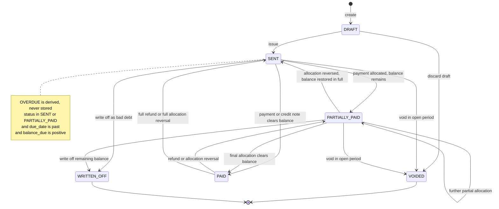
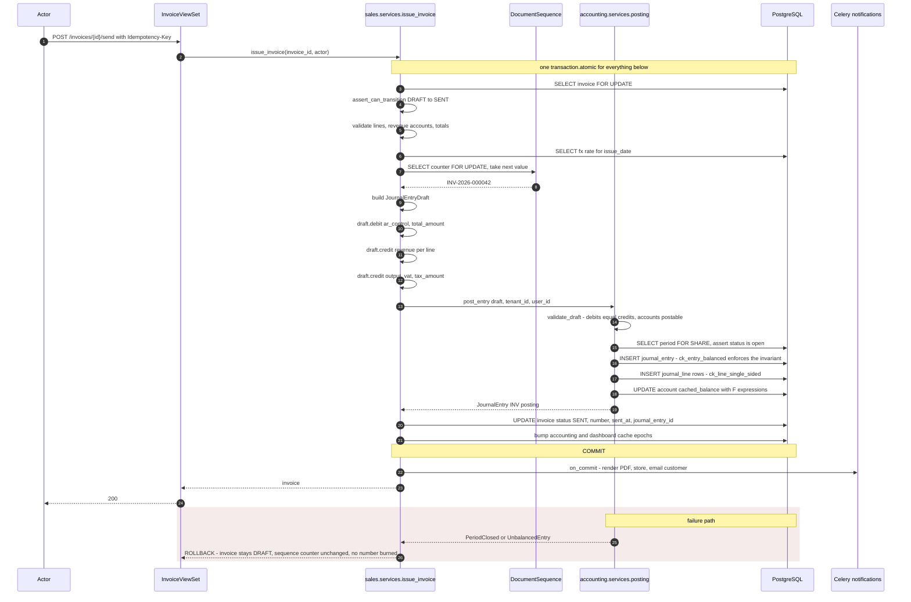
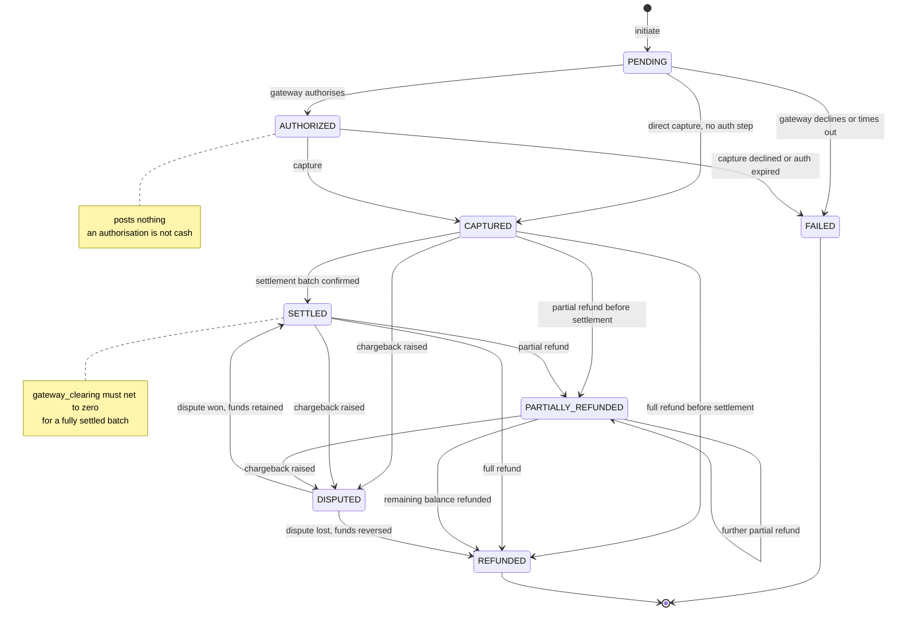
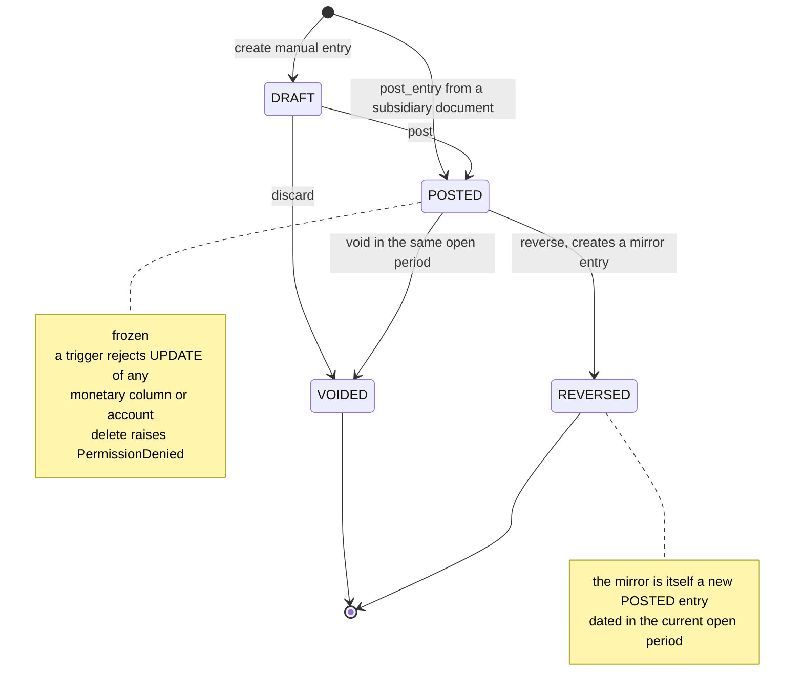
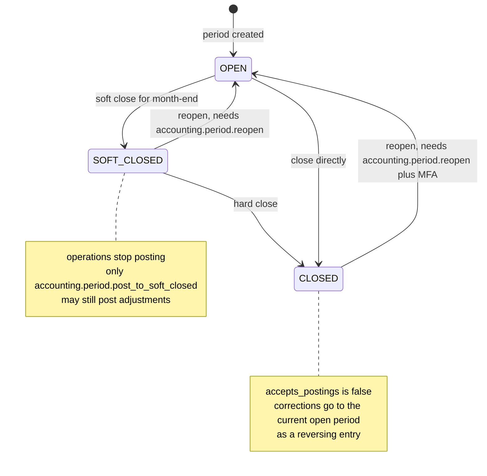
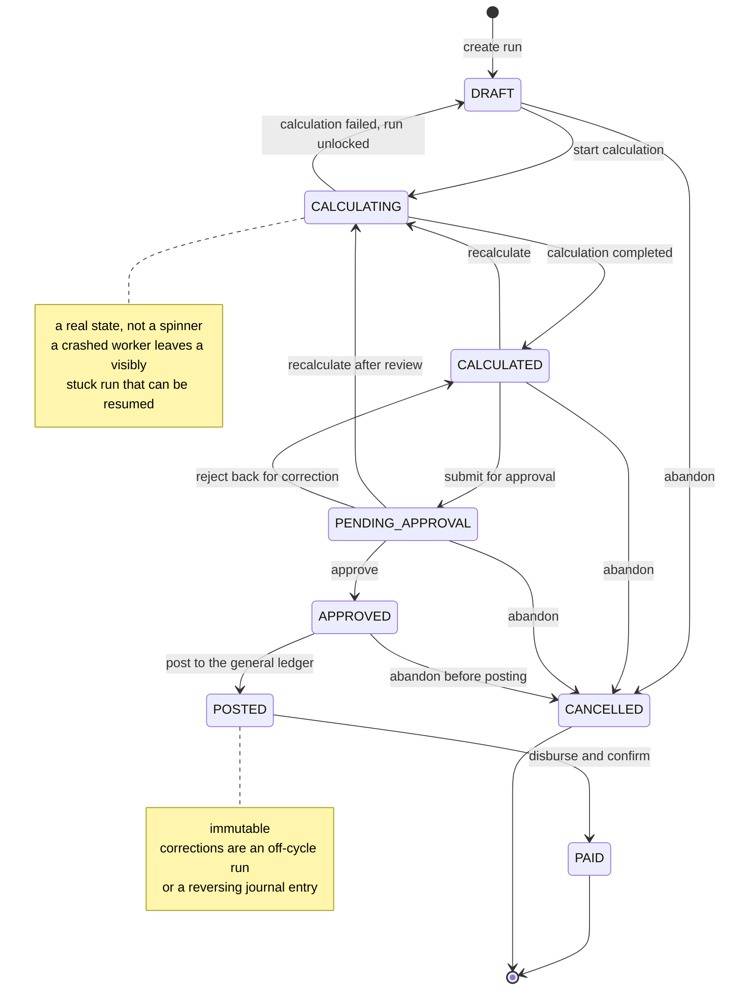
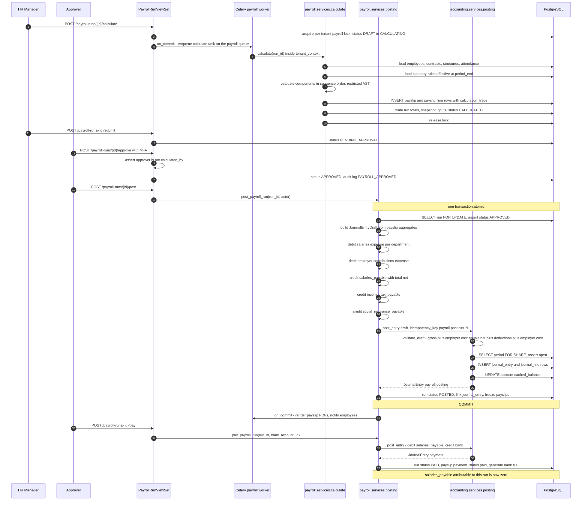
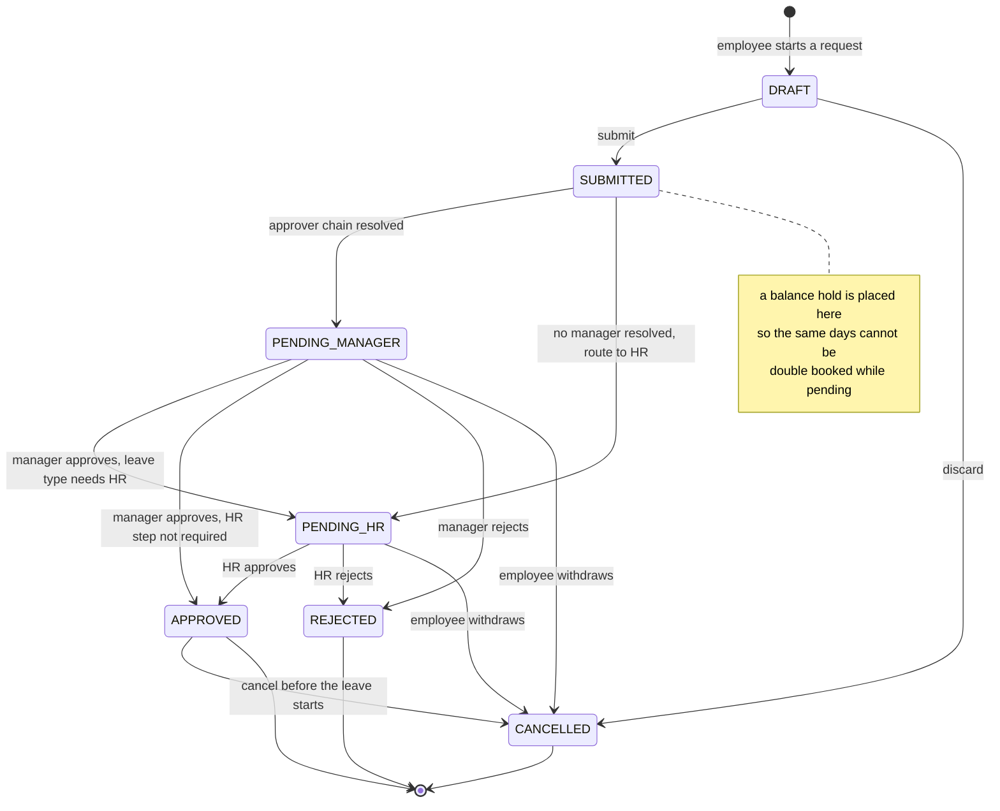
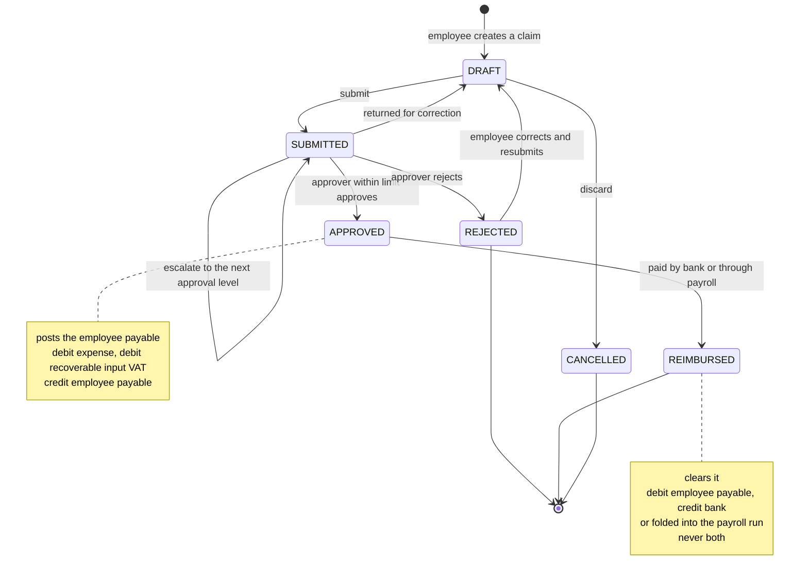
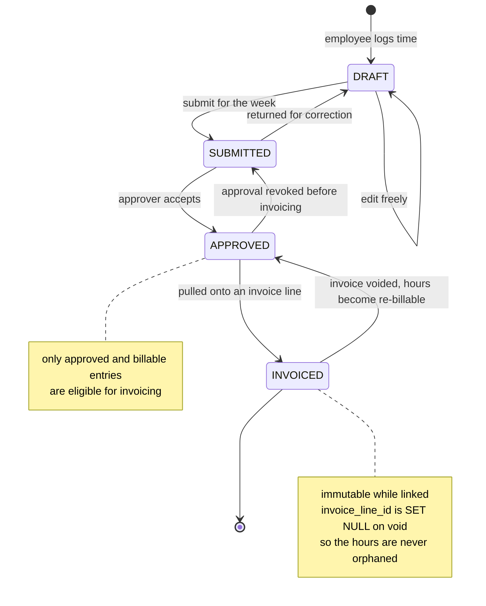

# 04 — State Machines

Every lifecycle in this system is an explicit finite state machine. Per
`CONVENTIONS.md` §4 the rules are:

* Status values are a `models.TextChoices` nested in the model, with `db_index=True`.
* Legal moves live in an explicit `ALLOWED_TRANSITIONS: dict[str, set[str]]`.
* A `transition()` method validates against that map. **A view never assigns
  `.status = ` directly.**
* Guards run inside the same transaction as the state change and its side effects.
  A state change that commits without its side effect is the bug class this whole
  document exists to prevent.

Reading the tables: *Guard* is what must be true for the move to be legal, checked
before anything is written. *Side effects* all happen inside the same
`transaction.atomic()` as the status write — except items marked **(on_commit)**, which
are enqueued via `transaction.on_commit()` because they touch the outside world.

---

## 1. Conventions used below

| Symbol | Meaning |
|---|---|
| `[*] -->` | Creation |
| `--> [*]` | Terminal state; the row persists forever, it is simply immovable |
| **derived** | Not a stored status. Computed at read time. |
| ⚠ | A transition that posts to the general ledger |

---

## 2. Invoice

`sales.Invoice.Status`: `draft`, `sent`, `partially_paid`, `paid`, `voided`,
`written_off`.

**`OVERDUE` is deliberately not a state.** It is derived at read time as:

```sql
status IN ('sent', 'partially_paid') AND due_date < CURRENT_DATE AND balance_due > 0
```

A stored overdue status goes stale the instant a payment lands, and then you need a
nightly job to un-stale it — which means the flag is wrong for up to 24 hours on the
exact documents a collections team is looking at.



### Transition table

| From | Event | To | Guard / precondition | Side effects |
|---|---|---|---|---|
| — | `create` | `DRAFT` | Tenant is operational; customer active | Row created with `number = ''` |
| `DRAFT` | `issue` | `SENT` ⚠ | ≥1 line; every line has a revenue account; `total_amount > 0`; period covering `issue_date` is `OPEN`; FX rate exists for a foreign currency; customer credit limit not exceeded, or override permission held | Allocate `number` from `DocumentSequence` under `FOR UPDATE`; `post_entry()` Dr *ar_control* / Cr revenue per line / Cr *output_vat*, `idempotency_key = invoice:issue:{id}`; set `sent_at`, `journal_entry_id`; freeze lines; bump the `accounting` + `dashboard` cache epochs; **(on_commit)** render PDF, store, email customer |
| `DRAFT` | `discard` | `VOIDED` | Actor holds `sales.invoice.void` | No GL effect — a draft never had one. No number was allocated, so no gap |
| `SENT` | `allocate_payment` | `PARTIALLY_PAID` | Allocation ≤ `balance_due`; payment is `CAPTURED` or later; allocation currency matches | `paid_amount += amount`; recompute `balance_due`; GL effect belongs to the payment, not the invoice |
| `SENT` / `PARTIALLY_PAID` | `allocate_payment` | `PAID` | Same, and resulting `balance_due == 0` | As above; set fully-paid timestamp; **(on_commit)** payment-received notification |
| `SENT` / `PARTIALLY_PAID` | `apply_credit_note` | `PARTIALLY_PAID` or `PAID` | Credit note is `ISSUED`, same customer, same currency; cumulative credits ≤ `total_amount` | `paid_amount += applied`; the credit note posts its own mirror entry |
| `SENT` / `PARTIALLY_PAID` | `void` | `VOIDED` ⚠ | Period containing `issue_date` is `OPEN`; `paid_amount == 0`; actor holds `sales.invoice.void`; non-empty reason | `void_entry()` on the issue entry — the invoice **keeps its number**; release any `INVOICED` timesheet entries back to `APPROVED`; reverse stock issues if the invoice shipped goods |
| `SENT` / `PARTIALLY_PAID` | `write_off` | `WRITTEN_OFF` ⚠ | Actor holds `accounting.invoice.write_off`; `balance_due > 0`; current period `OPEN`; reason recorded | `post_entry()` Dr *bad debt expense* / Cr *ar_control* for `balance_due`; set `written_off_at`, `write_off_entry`; audit-log |
| `PARTIALLY_PAID` | `reverse_allocation` | `SENT` | The allocation is not already reversed | `paid_amount -= amount`; if it returns to zero the invoice is `SENT` again |
| `PAID` | `refund` / `reverse_allocation` | `PARTIALLY_PAID` or `SENT` ⚠ | Refund is `COMPLETED`, or the allocation reversal is authorised | `paid_amount` reduced; the refund posts Dr *ar_control* / Cr *bank* |

### Illegal transitions and why

| Illegal | Why |
|---|---|
| `DRAFT → PAID` / `DRAFT → PARTIALLY_PAID` | A draft has no receivable. Allocating a payment against a document that never debited AR creates a credit balance in the control account and breaks the AR-subledger reconciliation. |
| `SENT → DRAFT` ("unsend") | The customer has the document and the AR is on the books. Un-issuing would either abandon a document number (an audit gap) or reuse it (a duplicate). Correct move: `VOID` and reissue, or a credit note. |
| `VOIDED → anything` | Terminal by definition. Its GL effect has already been reversed; re-activating would double-count. |
| `WRITTEN_OFF → PAID` | Not disallowed as a business event — it happens, a customer pays a written-off debt — but it is **not this transition**. It is a new receipt posted Dr *bank* / Cr *bad debt recovery*. Reanimating the invoice would silently reverse a bad-debt expense already reported in a closed period. |
| `PAID → VOIDED` | Voiding a paid invoice would strand the payment with nothing to settle. Refund the payment first, which walks the invoice back to `SENT`, and then void. |
| Voiding in a `CLOSED` or `SOFT_CLOSED` period | `void_entry()` refuses; the correction must land in the current open period as a credit note or a reversal, so filed figures do not change retroactively. |
| Any transition that changes lines on a non-`DRAFT` invoice | The document is issued. Line edits after issue mean the PDF the customer holds and the row in the database disagree. |

### GL posting interaction



The rollback branch is the point of the whole design: because numbering, posting and the
status change share one transaction, there is no state in which an invoice is `SENT`
without a balanced journal entry, and no state in which a number is consumed by a
document that does not exist.

---

## 3. Payment

`payments.Payment.Status`: `pending`, `authorized`, `captured`, `settled`, `failed`,
`refunded`, `partially_refunded`, `disputed`.

The states track the **economic** event, not the UI event. An authorisation is not cash
and posts nothing.



### Transition table

| From | Event | To | Guard / precondition | Side effects |
|---|---|---|---|---|
| — | `initiate` | `PENDING` | Amount > 0; currency valid; exactly one counterparty set | Row created; `idempotency_key` from the client or derived |
| `PENDING` | `authorize` | `AUTHORIZED` | Gateway returns an approval; signature verified | Store `provider_payment_id`, `authorized_at`, card last-4/brand. **No GL posting** |
| `PENDING` | `capture_direct` | `CAPTURED` ⚠ | Method has no auth step, e.g. bank transfer or cash | See `capture` below |
| `PENDING` / `AUTHORIZED` | `fail` | `FAILED` | Decline or authorisation expiry received | Store `failed_reason`; **(on_commit)** notify; no GL effect ever existed |
| `AUTHORIZED` | `capture` | `CAPTURED` ⚠ | Auth not expired; capture amount ≤ authorised amount | `post_entry()` Dr *gateway_clearing* / Cr *ar_control*, `idempotency_key = payment:capture:{provider_event_id}`; create `PaymentAllocation` rows against invoices; advance each invoice's state; `captured_at` |
| `CAPTURED` | `settle` | `SETTLED` ⚠ | Settlement webhook or batch report received; **fee taken from the payload, never estimated** | `post_entry()` Dr *bank* net / Dr *bank_fees* / Cr *gateway_clearing* gross; set `settled_at`, `fee_amount`, `net_amount`; mark the corresponding bank line matchable |
| `CAPTURED` / `SETTLED` / `PARTIALLY_REFUNDED` | `refund` (partial) | `PARTIALLY_REFUNDED` ⚠ | Cumulative refunds < `amount`; refund authorised by the gateway | `post_entry()` Dr *ar_control* / Cr *bank*; restore `Invoice.balance_due`; walk the invoice back to `PARTIALLY_PAID` or `SENT` |
| `CAPTURED` / `SETTLED` / `PARTIALLY_REFUNDED` | `refund` (full) | `REFUNDED` ⚠ | Cumulative refunds == `amount` | As above for the remaining amount; reverse all allocations |
| `CAPTURED` / `SETTLED` / `PARTIALLY_REFUNDED` | `dispute_opened` | `DISPUTED` ⚠ | Provider dispute event | `post_entry()` Dr *disputed receivable* / Cr *bank* for the held amount; open a `Dispute` row with `due_by`; **(on_commit)** alert finance |
| `DISPUTED` | `dispute_won` | `SETTLED` ⚠ | Provider resolution: won | Reverse the hold entry; restore the settled position |
| `DISPUTED` | `dispute_lost` | `REFUNDED` ⚠ | Provider resolution: lost | Post the loss including the dispute fee to *bank_fees*; reverse allocations; the invoice returns to `SENT` and is eligible for write-off |

### Illegal transitions and why

| Illegal | Why |
|---|---|
| `PENDING → SETTLED` | Skipping capture means money appears in the bank account with nothing having cleared AR. The clearing account would carry a permanent phantom balance, which is precisely what the 5-day clearing-age alert is designed to catch. |
| `AUTHORIZED → SETTLED` | Same: settlement moves value *out of* the clearing account; if capture never put it there, the account goes negative. |
| `FAILED → anything` | Terminal. A retry is a **new** `Payment` row with a new `provider_payment_id`. Reusing the row destroys the one-to-one correspondence with the gateway's record, which is what a dispute investigation depends on. |
| `REFUNDED → CAPTURED` | The money went back. A subsequent charge is a new payment. |
| `SETTLED → CAPTURED` | Settlement is an external fact. You cannot un-settle; you refund. |
| `SETTLED → PENDING` | Would orphan the bank and fee postings. |
| Capturing more than the authorised amount | Gateways reject it, and a partial capture that "rounds up" produces an AR credit the customer never agreed to. |
| Any transition driven by a webhook whose signature failed | Not a transition at all — the event is stored for forensics and returns `400`. |

**Out-of-order webhooks** are the normal case, not the exception: settlement can arrive
before capture. Such an event is **parked** (`WebhookEvent.status = 'parked'`) and
retried with exponential backoff for up to 24 hours, then alerted. It is never dropped
and never forced through — forcing it would post a settlement against a clearing balance
that does not exist yet.

---

## 4. JournalEntry

`accounting.JournalEntry.Status` and its `ALLOWED_TRANSITIONS`, exactly as implemented in
`apps/accounting/models.py`:

```python
ALLOWED_TRANSITIONS = {
    Status.DRAFT:    {Status.POSTED, Status.VOIDED},
    Status.POSTED:   {Status.VOIDED, Status.REVERSED},
    Status.VOIDED:   set(),
    Status.REVERSED: set(),
}
```



### Transition table

| From | Event | To | Guard / precondition | Side effects |
|---|---|---|---|---|
| — | `create` | `DRAFT` | Actor holds `accounting.journal_entry.create` | `number = ''` — a draft never burns a number |
| — | `post_entry()` | `POSTED` ⚠ | The whole of `validate_draft()`: ≥2 lines; `quantize(Σdebit) == quantize(Σcredit)`; total > 0; `exchange_rate > 0`; every account exists in this tenant, is `is_postable` and `is_active`; period resolved and locked `FOR SHARE` and `OPEN` (or `SOFT_CLOSED` with `allow_soft_closed`); journal exists and is active; `idempotency_key` unused | Allocate `number` from `DocumentSequence`; insert entry with materialised `total_debit`/`total_credit`; insert lines with `base_debit`/`base_credit` at the entry's FX rate; `_apply_to_cached_balances(sign=+1)` via `F()` |
| `DRAFT` | `post` | `POSTED` ⚠ | As above | As above |
| `DRAFT` | `discard` | `VOIDED` | Actor holds `accounting.journal_entry.void` | No GL effect; no number to preserve |
| `POSTED` | `void_entry()` | `VOIDED` | Period containing `entry_date` is **`OPEN`** — not soft-closed, not closed; non-empty reason | `_apply_to_cached_balances(sign=-1)`; set `void_reason`; **the entry keeps its number**; audit-log `ENTRY_REVERSED` |
| `POSTED` | `reverse_entry()` | `REVERSED` ⚠ | Entry is `POSTED`; not already reversed (`hasattr(entry, "reversed_by")`); the reversal date falls in an open period | Build a mirror draft with every line's debit and credit **swapped** — that is the whole of "reversal"; post it with `idempotency_key = reversal:{entry.id}`; set the original to `REVERSED`; set `mirror.reversal_of = original` |

### Illegal transitions and why

| Illegal | Why |
|---|---|
| `POSTED → DRAFT` | Un-posting would silently change every report already produced from that period, including ones already filed. This is the transition that separates an accounting system from a spreadsheet. |
| `VOIDED → POSTED`, `REVERSED → anything` | Both are terminal. A void has already backed out the balances; a reversal already exists as a separate document. Re-posting would double-count. |
| Deleting any entry or line | `ImmutableFinancialModel.delete()` raises, a trigger blocks monetary `UPDATE`s on posted rows, and the application DB role lacks `DELETE`. Three layers, because any one of them alone is a single point of failure. |
| Voiding in a `SOFT_CLOSED` or `CLOSED` period | `void_entry()` raises `PeriodClosed` with a message directing the user to reverse instead. Voiding rewrites history in place; reversing records both the error and its correction, which is what an auditor needs to see. |
| Reversing an entry twice | The `OneToOneField` `reversal_of` plus the `hasattr` check make a second reversal impossible — otherwise the ledger would swing twice for one error. |
| Posting into a period that closed mid-transaction | Prevented by the `SELECT ... FOR SHARE` on `FiscalPeriod` inside `post_entry()`. `FOR SHARE` rather than `FOR UPDATE` so that concurrent posts proceed in parallel and only a period *close* (which takes `FOR UPDATE`) has to wait. |
| Posting an entry with a single line, or with zero total | `validate_draft()` refuses. A single-sided entry cannot balance; a zero entry is noise in the ledger with no economic content. |
| A line with both `debit > 0` and `credit > 0`, or with neither | `LineDraft.__post_init__` refuses in Python and `ck_line_single_sided` refuses in SQL. Negative amounts belong on the opposite side, not as a negative. |

---

## 5. FiscalPeriod

`accounting.FiscalPeriod.Status`: `open`, `soft_closed`, `closed`.



`accepts_postings` is `status == OPEN`. `post_entry(allow_soft_closed=True)` is the only
way into a `SOFT_CLOSED` period, and the caller must hold
`accounting.period.post_to_soft_closed`.

### Transition table

| From | Event | To | Guard / precondition | Side effects |
|---|---|---|---|---|
| — | `create` | `OPEN` | No overlapping period for this tenant (`uq_period_start`); `end_date >= start_date`; parent `FiscalYear` is `OPEN` | Row created |
| `OPEN` | `soft_close` | `SOFT_CLOSED` | Actor holds `accounting.period.soft_close`; all prior periods are `SOFT_CLOSED` or `CLOSED` | `SELECT ... FOR UPDATE` on the period, which serialises against in-flight posts; **(on_commit)** notify operations that the period is closing |
| `SOFT_CLOSED` | `reopen` | `OPEN` | Actor holds `accounting.period.reopen` | Audit-log with reason |
| `OPEN` / `SOFT_CLOSED` | `close` | `CLOSED` | Actor holds `accounting.period.close`; **all prior periods `CLOSED`**; no `DRAFT` entries remain in the period; every bank account reconciled or explicitly waived; the `suspense` account is empty; `assert_ledger_balanced()` passes | `FOR UPDATE` lock; set `closed_at`, `closed_by`; audit-log `PERIOD_CLOSED`; **(on_commit)** snapshot `reporting.PeriodBalance` for every account; bump report cache epochs |
| `CLOSED` | `reopen` | `OPEN` | Actor holds `accounting.period.reopen` **and** re-authenticates with MFA; the parent `FiscalYear` is still `OPEN`; **no later period is `CLOSED`** — you reopen in reverse chronological order or not at all; a written reason is mandatory | Audit-log `PERIOD_CLOSED` with `reopened: true` and the reason; invalidate `PeriodBalance` for this and every later period; **(on_commit)** notify every tenant admin, because someone is about to change filed figures |

### Illegal transitions and why

| Illegal | Why |
|---|---|
| Closing a period while an earlier one is `OPEN` | Produces a hole in the ledger's chronology. A trial balance "as of" a date inside the hole is not reproducible, and year-end close would roll an incomplete P&L into retained earnings. |
| Reopening a period when a later period is `CLOSED` | The later close consumed the earlier period's closing balance as its opening balance. Changing the earlier period silently invalidates every later opening balance and every report built on it. |
| Reopening a period in a `CLOSED` fiscal year | The year-end close already rolled the P&L into `retained_earnings`. Reopening would require unwinding that appropriation, and the correct instrument for a prior-year correction is a current-year adjusting entry, not time travel. |
| Posting into `CLOSED` | `post_entry()` raises `PeriodClosed`. This is the lock the whole design exists to make real. |
| Posting into `SOFT_CLOSED` without the permission | Defeats the purpose of soft close, which is to stop *operational* posting while the accountant finishes adjustments. |
| Closing with `DRAFT` entries still in the period | A draft in a closed period can never be posted and can never be corrected; it becomes permanently stuck work. |

**Why `SOFT_CLOSED` exists at all.** Month-end is a process, not an instant. Without a
soft-close state, teams leave periods open "just in case", and prior-period figures then
change silently after they were reported. The soft-closed state names the real
intermediate condition — closed to operations, open to the accountant — so nobody has to
invent that workaround.

---

## 6. PayrollRun

`payroll.PayrollRun.Status`: `draft`, `calculating`, `calculated`, `pending_approval`,
`approved`, `posted`, `paid`, `cancelled`.



### Transition table

| From | Event | To | Guard / precondition | Side effects |
|---|---|---|---|---|
| — | `create` | `DRAFT` | Actor holds `payroll.run.create`; no non-cancelled run already exists for this `(period_start, period_end, run_type, department)` — `uq_payroll_run_period` | Allocate `number`; resolve `fiscal_period` |
| `DRAFT` | `calculate` | `CALCULATING` | Period covering `payment_date` is `OPEN`; ≥1 eligible employee; every employee has an active contract and a salary structure; attendance for the period is approved; per-tenant Redis payroll lock acquired | Set `calculated_by`; write `calculation_snapshot` freezing structures, components and statutory bands; **(on_commit)** enqueue the calculation task on the `payroll` queue |
| `CALCULATING` | `complete` | `CALCULATED` | Every employee produced a payslip; `Σ net + Σ deductions == Σ gross` for every payslip; no negative net without an explicit override | Insert `Payslip` and `PayslipLine` rows with `calculation_trace`; write run totals; release the lock |
| `CALCULATING` | `fail` | `DRAFT` | Task raised, or the run has been `CALCULATING` for more than 15 minutes | Delete partial payslips; store the error; release the lock; alert. **The run is never left half-calculated** |
| `CALCULATED` / `PENDING_APPROVAL` | `recalculate` | `CALCULATING` | Actor holds `payroll.run.calculate` | Atomically discard **all** payslips and rebuild; refresh the snapshot |
| `CALCULATED` | `submit` | `PENDING_APPROVAL` | Actor holds `payroll.run.submit`; totals are non-zero | **(on_commit)** notify approvers |
| `PENDING_APPROVAL` | `reject` | `CALCULATED` | Actor holds `payroll.run.approve`; reason recorded | Clear approval fields; notify the preparer |
| `PENDING_APPROVAL` | `approve` | `APPROVED` | Actor holds `payroll.run.approve`; **`approver != calculated_by`** unless the tenant has explicitly disabled segregation of duties; MFA re-authentication within 10 minutes | Set `approved_by`, `approved_at`; audit-log `PAYROLL_APPROVED` with both actor ids |
| `APPROVED` | `post` | `POSTED` ⚠ | Period containing `payment_date` is `OPEN`; actor holds `payroll.run.post` | `post_entry()` — Dr *salaries expense* per department / Dr *employer contributions expense* / Cr *salaries_payable* net / Cr *income_tax_payable* / Cr *social_insurance_payable*, with `JournalLine.department` set on every expense line, `idempotency_key = payroll:post:{run.id}`; link `journal_entry`; make payslips immutable; **(on_commit)** render payslip PDFs, notify employees |
| `POSTED` | `pay` | `PAID` ⚠ | Bank account selected and active; transfer file generated; disbursement confirmed | `post_entry()` Dr *salaries_payable* / Cr *bank*; link `payment_entry`; set every payslip `payment_status = paid`; the run's salaries-payable balance is now zero; reimburse any linked `ExpenseClaim`s |
| `DRAFT` / `CALCULATED` / `PENDING_APPROVAL` / `APPROVED` | `cancel` | `CANCELLED` | Actor holds `payroll.run.cancel`; run is **not** `POSTED`; reason recorded | Delete payslips; unlink any `ExpenseClaim.payroll_run` so those claims revert to unreimbursed; audit-log |

### Illegal transitions and why

| Illegal | Why |
|---|---|
| `POSTED → CANCELLED` or `POSTED → APPROVED` | The GL entry exists. Cancelling would delete a posted financial record, which `ImmutableFinancialModel` forbids outright. The correction is a reversing journal entry plus an off-cycle run. |
| `PAID → anything` | Money left the bank. Recovery is a new transaction, not a state change. |
| `CANCELLED → anything` | Terminal. Create a new run. |
| `DRAFT → APPROVED` (skipping calculation) | Approving figures that do not exist yet. The approver's audit trail must attest to specific numbers. |
| `CALCULATED → POSTED` (skipping approval) | Removes the only human control on the largest single money movement the company makes each month. |
| `approved_by == calculated_by` | Segregation of duties (FR-PRL-08). One person creating and approving payroll is the textbook payroll fraud pattern — the ghost employee. Overriding it requires an explicit tenant setting and is audit-logged. |
| Posting into a `CLOSED` period | `post_entry()` raises. Payroll for a closed month is posted in the current month with a reversal, or the period is reopened deliberately by someone with `accounting.period.reopen`. |
| Two concurrent runs for the same period | `uq_payroll_run_period` (partial, excluding cancelled) makes it a database error rather than a duplicated salary payment. |
| Editing a payslip after `POSTED` | Payslips are statutory records with a 7-year retention. Corrections are an off-cycle run. |

### GL posting interaction



---

## 7. LeaveRequest

`hr.LeaveRequest.Status`: `draft`, `submitted`, `pending_manager`, `pending_hr`,
`approved`, `rejected`, `cancelled`.

`SUBMITTED` is the momentary state in which the approver chain is resolved;
`PENDING_HR` is skipped entirely when `LeaveType.requires_hr_approval` is false.



### Transition table

| From | Event | To | Guard / precondition | Side effects |
|---|---|---|---|---|
| — | `create` | `DRAFT` | Employee is `ACTIVE` | Row created; `days_requested` computed from the working calendar, excluding holidays and weekends |
| `DRAFT` | `submit` | `SUBMITTED` | `days_requested > 0`; available balance ≥ requested, or the leave type permits a negative balance; **no overlap** with an existing approved or pending request — enforced by the GiST exclusion constraint `uq_leave_no_overlap`; notice period satisfied or overridden | Write a `LeaveTransaction` of type `hold` for the requested days and link it as `hold_transaction`; recompute the cached `LeaveBalance` |
| `SUBMITTED` | `route` | `PENDING_MANAGER` | `Employee.manager` resolves, falling back to the department head | **(on_commit)** notify the manager |
| `SUBMITTED` | `route` | `PENDING_HR` | Neither a manager nor a department head resolves | Route to HR **with a warning** — a silent auto-approval here is how leave governance quietly stops existing |
| `PENDING_MANAGER` | `manager_approve` | `PENDING_HR` | Actor is the resolved manager or holds `hr.leave_request.approve` with a covering ABAC scope; **actor is not the requester**; `LeaveType.requires_hr_approval` | Record `manager_approver`, `manager_decided_at`; notify HR |
| `PENDING_MANAGER` | `manager_approve` | `APPROVED` | As above, and HR approval is not required | Convert the `hold` into a `usage` `LeaveTransaction`; recompute balance; write the days into the attendance calendar; **(on_commit)** notify employee and payroll if `affects_payroll` |
| `PENDING_HR` | `hr_approve` | `APPROVED` | Actor holds `hr.leave_request.approve_hr`; actor is not the requester | As above |
| `PENDING_MANAGER` / `PENDING_HR` | `reject` | `REJECTED` | Approver at that stage; reason recorded | Write a `release` `LeaveTransaction` cancelling the hold **in the same transaction**; notify employee |
| `DRAFT` / `PENDING_MANAGER` / `PENDING_HR` | `cancel` | `CANCELLED` | Actor is the requester or holds `hr.leave_request.cancel` | Release the hold |
| `APPROVED` | `cancel` | `CANCELLED` | `start_date` is in the future, **or** the actor holds `hr.leave_request.cancel_started`; the payroll period covering the leave is not yet `POSTED` | Write a reversing `LeaveTransaction`; remove the calendar entries; notify the approver chain |

### Illegal transitions and why

| Illegal | Why |
|---|---|
| `DRAFT → APPROVED` | Skips the balance hold and the approval chain, so two requests for the same days can both succeed. |
| `REJECTED → APPROVED` | The rejection is the decision of record. A change of mind is a new request, so the audit trail shows both the rejection and the later approval. |
| Approving your own request at any stage | Even a department head holding `approve` with a subtree scope: the subtree includes themselves. Self-approval is blocked unconditionally, ahead of the permission check. |
| `APPROVED → CANCELLED` after the payroll period is posted | The leave already affected a payslip that is now a statutory record. The correction is an off-cycle adjustment, not a state change. |
| Overlapping approved requests | The `EXCLUDE USING gist` constraint refuses. Without it, two approvers acting simultaneously on two overlapping requests both see a valid balance and both commit. |
| Any transition that mutates `LeaveBalance` directly | Balance is `SUM(LeaveTransaction.days)`. A mutable balance column that services write to will drift; the ledger cannot. `LeaveBalance` is a cached projection, recomputed nightly and treated exactly like `Account.cached_balance`. |

---

## 8. Expense approval

`expenses.ExpenseClaim.Status`: `draft`, `submitted`, `approved`, `rejected`,
`reimbursed`.



### Transition table

| From | Event | To | Guard / precondition | Side effects |
|---|---|---|---|---|
| — | `create` | `DRAFT` | Employee is `ACTIVE` | Allocate a claim number |
| `DRAFT` | `submit` | `SUBMITTED` | ≥1 line; every line over the tenant's `expenses.require_receipt_over` threshold has an attachment; every `expense_date` falls in an `OPEN` or `SOFT_CLOSED` period; total > 0; currency consistent | Compute totals; resolve the approver chain from the submitter's department subtree; create `ExpenseApproval` step 1; **(on_commit)** notify the approver |
| `SUBMITTED` | `approve` | `APPROVED` ⚠ | Approver holds `expenses.claim.approve`; the submitter is within the approver's ABAC scope; **approver is not the submitter**; `total_amount <= ScopeRule.parameters["max_amount"]` | `post_entry()` Dr expense account per line / Dr *input_vat* for recoverable tax only / Cr *employee_payable*, `idempotency_key = expense:approve:{claim.id}`; set `approved_by`, `approved_at`; link `approval_entry`; allocate billable lines to their projects |
| `SUBMITTED` | `escalate` | `SUBMITTED` | `total_amount` exceeds the current approver's `max_amount` | Create the next `ExpenseApproval` step at the next rank up; notify. The claim does not change state — it changes *approver* |
| `SUBMITTED` | `reject` | `REJECTED` | Approver in the chain; reason recorded | No GL effect ever occurred; notify the submitter |
| `SUBMITTED` | `return` | `DRAFT` | Approver requests changes rather than rejecting | Clear approval steps so the chain is re-resolved on resubmission |
| `REJECTED` | `revise` | `DRAFT` | Actor is the submitter | Reset approvals |
| `APPROVED` | `reimburse` (bank) | `REIMBURSED` ⚠ | `reimbursement_method = bank`; bank account active; period `OPEN` | `post_entry()` Dr *employee_payable* / Cr *bank*; link `reimbursement_entry`; set `reimbursed_amount` |
| `APPROVED` | `reimburse` (payroll) | `REIMBURSED` ⚠ | `reimbursement_method = payroll`; a `PayrollRun` in `DRAFT` or `CALCULATED` exists for the employee | Link `payroll_run`; add a non-taxable reimbursement pay component to the payslip. **No separate journal entry** — the payroll posting clears the payable. Double-posting here is the classic duplicate-reimbursement bug |
| `DRAFT` | `discard` | `CANCELLED` | Actor is the submitter | No GL effect |

### Illegal transitions and why

| Illegal | Why |
|---|---|
| `DRAFT → APPROVED` | Bypasses the approval chain and the receipt requirement — an unsupported expense debit is exactly what an auditor disallows. |
| `DRAFT → REIMBURSED` | Would pay money against a claim with no approval and no employee payable to clear. |
| `APPROVED → DRAFT` / `APPROVED → REJECTED` | The employee payable is on the books. Reverse the approval entry explicitly instead — the ledger must show that the liability was recognised and then removed. |
| `REIMBURSED → anything` | Terminal. An overpayment is recovered through a new transaction. |
| Self-approval | Blocked unconditionally, even for an actor holding `expenses.claim.approve` whose ABAC scope covers their own department. This check runs before the permission check. |
| Approving above `max_amount` | The approval limit is data on the `ScopeRule`, enforced in the guard. Exceeding it escalates rather than failing, so no claim is stuck. |
| Reimbursing both by bank and through payroll | Guarded by `ck_expense_reimbursed_not_over_total` plus the single-transition constraint. This is the duplicate-payment bug the `reimbursement_method` field exists to prevent. |
| Deleting a receipt attachment on an approved claim | `ExpenseClaimLine.attachment` is `PROTECT` — the expense would become unsupported after the fact. |

---

## 9. TimesheetEntry

`projects.TimesheetEntry.Status`: `draft`, `submitted`, `approved`, `invoiced`.



### Transition table

| From | Event | To | Guard / precondition | Side effects |
|---|---|---|---|---|
| — | `create` | `DRAFT` | Employee is an active `ProjectMember`; project is `ACTIVE`; `work_date` is not in the future beyond the tenant's tolerance | Resolve and **store** `billing_rate` and `cost_rate` — task override → project member → project default → employee default. Storing them here is why a later rate change never rewrites history |
| `DRAFT` | `edit` | `DRAFT` | Actor is the owner | Rates are **not** re-resolved unless the project or task changes |
| `DRAFT` | `submit` | `SUBMITTED` | `0 < hours <= 24`; total hours for the employee on that date ≤ 24 (overlaps across projects are warned about, not blocked — a consultant may bill two clients in the same hour under some contracts); description present when the project requires one | **(on_commit)** notify the approver. Bulk weekly submission is one transaction; one invalid entry fails the whole batch with the offending entry identified |
| `SUBMITTED` | `approve` | `APPROVED` | Approver holds `projects.timesheet.approve`; the employee is within the approver's ABAC scope; **approver is not the owner** | Set `approved_by`, `approved_at`; the entry becomes eligible for invoicing and for project actual-cost reporting |
| `SUBMITTED` | `return` | `DRAFT` | Approver; reason recorded | Notify the owner |
| `APPROVED` | `revoke` | `SUBMITTED` | `invoice_line_id IS NULL`; actor holds `projects.timesheet.approve` | Clear approval fields |
| `APPROVED` | `invoice` | `INVOICED` | `is_billable`; project `billing_type` is `time_and_materials`; the invoice is `DRAFT` and belongs to the project's customer; the entry is not already linked | Set `invoice_line_id`; the entry becomes immutable. The invoice's own issue transition is what posts to the GL — a timesheet entry never posts on its own |
| `INVOICED` | `release` | `APPROVED` | The linked invoice was voided, or its line was removed while still `DRAFT` | `invoice_line_id` set to NULL by the `SET_NULL` policy; the hours become re-billable |

### Illegal transitions and why

| Illegal | Why |
|---|---|
| `DRAFT → INVOICED` | Billing a client for hours nobody approved. The approval is the control that makes the invoice defensible in a dispute. |
| `SUBMITTED → INVOICED` | Same. |
| Editing `hours`, `work_date` or rates while `INVOICED` | The client holds an invoice built from those numbers. Editing them makes the invoice and the timesheet disagree, which is the first thing a client's procurement team checks. |
| `INVOICED → DRAFT` | Skips the approved state and would let an already-billed entry be silently re-billed. |
| Approving your own entry | Self-approval defeats the control entirely; billable hours are revenue. |
| Leaving an entry stranded in `INVOICED` after a void | This is why `TimesheetEntry.invoice_line` is `SET_NULL` rather than `PROTECT` or `CASCADE`. `PROTECT` would block the void; `CASCADE` would delete the hours worked. `SET_NULL` plus the `INVOICED → APPROVED` transition is the only policy that keeps the work record and makes the hours billable again. |
| Logging time against a `COMPLETED` or `CANCELLED` project | Project actuals for a closed engagement would change after the profitability report was produced. |

---

## 10. Cross-machine invariants

Rules that span more than one state machine. Each is enforced in code and each has a
nightly integrity check behind it.

| # | Invariant | Enforced by | Detected by |
|---|---|---|---|
| X-01 | An `Invoice` in `SENT` or later has exactly one non-voided issue `JournalEntry` | Single transaction in `issue_invoice` | Nightly AR-control vs subledger check |
| X-02 | `Σ PaymentAllocation.amount` for an invoice ≤ `Invoice.total_amount` | Service guard + `ck_invoice_paid_not_over` | Nightly over-allocation query |
| X-03 | `gateway_clearing` nets to zero for every fully settled batch | Capture and settlement post opposite sides | Alert on any clearing balance older than 5 days |
| X-04 | `salaries_payable` attributable to a `PAID` run is zero | Payroll post and pay entries mirror each other | Nightly payable-ageing check |
| X-05 | No `POSTED` `JournalEntry` exists in a `CLOSED` period with `posted_at` after `closed_at` | `FOR SHARE` / `FOR UPDATE` lock pairing in `post_entry` and period close | Nightly period-integrity query |
| X-06 | Every `INVOICED` `TimesheetEntry` points at a live, non-voided invoice line | `SET_NULL` plus the release transition | Nightly orphan-timesheet query |
| X-07 | Every `APPROVED` `ExpenseClaim` has exactly one approval entry, and every `REIMBURSED` claim exactly one reimbursement path | `idempotency_key` on both postings; `reimbursement_method` is single-valued | Nightly duplicate-reimbursement query |
| X-08 | `LeaveBalance` equals `SUM(LeaveTransaction.days)` for every (employee, type, year) | Balance is a cached projection only | Nightly recompute and compare |
| X-09 | Document numbers are gapless per (tenant, scope, year) | Counter row locked `FOR UPDATE` inside the allocating transaction | Nightly sequence-gap check |
| X-10 | `SUM(base_debit) == SUM(base_credit)` across all posted lines, per tenant | `ck_entry_balanced` plus the single posting choke point | **`assert_ledger_balanced()` nightly — P1 page on failure** |
