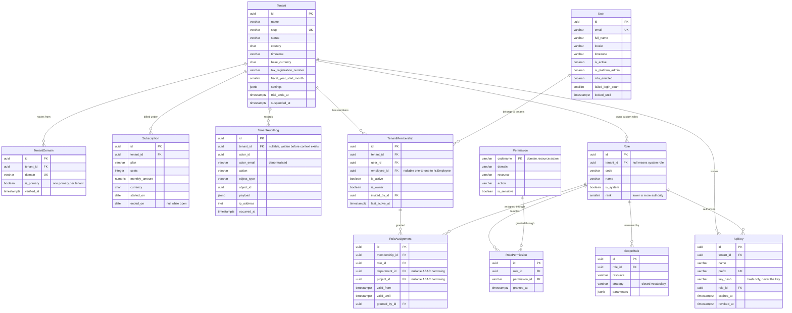
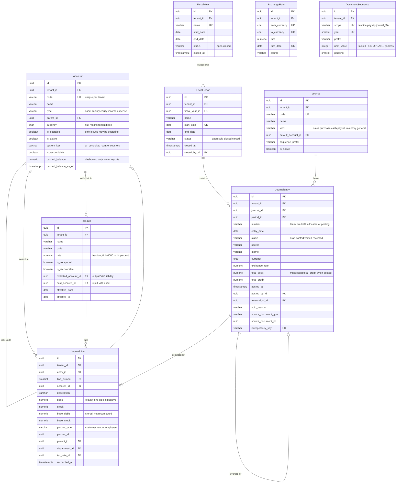
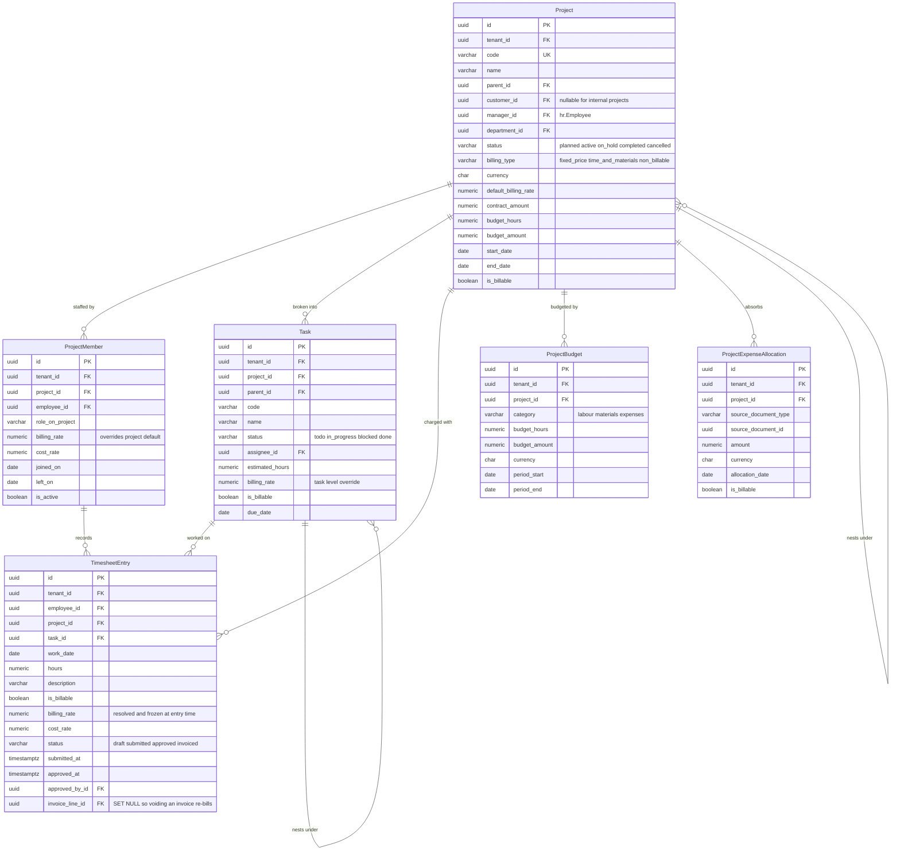

# Entity Relationship Diagrams

A single diagram covering ~90 entities is unreadable, so the schema is split into six
clusters plus a seventh diagram showing only the edges that cross cluster boundaries.

**Reading these diagrams**

* Every entity that subclasses `TenantScopedModel` carries `id UUID PK`,
  `tenant_id UUID FK`, `created_at`, `updated_at`, `created_by_id`, `updated_by_id`.
  Only `id` and `tenant_id` are repeated below; the audit columns are omitted for
  legibility.
* `numeric` means `numeric(19,6)` for money and quantities, `numeric(9,6)` for rates.
* Cardinality: `||--o{` = one-to-zero-or-many, `||--||` = one-to-one,
  `}o--||` = zero-or-many-to-one, `||--|{` = one-to-one-or-many.
* Entities shown in more than one diagram are repeated with an abbreviated attribute
  list; the authoritative definition is in the cluster that owns the app.
* Authoritative column-level detail is in `03-data-model.md`.

---

## a. Tenancy and IAM

The tenant is the scope, not a scoped row. Authorisation is two-layered: RBAC decides
*whether*, ABAC (`ScopeRule`) decides *on which rows*.

---

## b. Accounting core

The general ledger. `JournalLine` carries separate non-negative `debit` and `credit`
columns, so "the entry balances" is a plain SQL constraint rather than a convention.

---

## c. Sales, Payments and Expenses

The AR and AP subledgers plus the money that settles them. Every document here produces
a journal entry through `post_entry()`; the edge to `JournalEntry` is shown in diagram (g).

```mermaid
erDiagram
    Customer ||--o{ Quote : "receives"
    Customer ||--o{ SalesOrder : "places"
    Customer ||--o{ Invoice : "is billed"
    Customer ||--o{ CreditNote : "is credited"
    Customer ||--o{ Payment : "pays"
    Customer ||--o{ CustomerContact : "has"
    Customer ||--o{ RecurringInvoiceTemplate : "subscribed under"
    PaymentTerm ||--o{ Customer : "defaults for"
    PaymentTerm ||--o{ Invoice : "sets due date"
    Quote ||--|{ QuoteLine : "composed of"
    Quote ||--o| SalesOrder : "converts to"
    SalesOrder ||--|{ SalesOrderLine : "composed of"
    SalesOrder ||--o{ Invoice : "billed by"
    Invoice ||--|{ InvoiceLine : "composed of"
    Invoice ||--o{ CreditNote : "credited by"
    CreditNote ||--|{ CreditNoteLine : "composed of"
    RecurringInvoiceTemplate ||--o{ RecurringOccurrence : "generates"
    RecurringOccurrence ||--o| Invoice : "produced"

    Vendor ||--o{ PurchaseOrder : "supplies"
    Vendor ||--o{ VendorBill : "bills us"
    Vendor ||--o{ Payment : "is paid"
    PurchaseOrder ||--|{ PurchaseOrderLine : "composed of"
    PurchaseOrder ||--o{ VendorBill : "matched to"
    VendorBill ||--|{ VendorBillLine : "composed of"

    PaymentMethod ||--o{ Payment : "settled by"
    GatewayAccount ||--o{ Payment : "processed through"
    GatewayAccount ||--o{ WebhookEvent : "notifies via"
    Payment ||--o{ PaymentAllocation : "applied through"
    Payment ||--o{ Refund : "refunded by"
    Payment ||--o{ Dispute : "disputed as"
    Invoice ||--o{ PaymentAllocation : "settled by"
    VendorBill ||--o{ PaymentAllocation : "settled by"
    CreditNote ||--o{ PaymentAllocation : "applied by"
    WebhookEvent ||--o| Payment : "resolves to"

    ExpenseCategory ||--o{ ExpenseClaimLine : "classifies"
    ExpenseClaim ||--|{ ExpenseClaimLine : "composed of"
    ExpenseClaim ||--o{ ExpenseApproval : "approved through"
    MileageRate ||--o{ ExpenseClaimLine : "prices distance for"

    Customer {
        uuid id PK
        uuid tenant_id FK
        varchar code UK
        varchar display_name
        varchar legal_name
        varchar tax_registration_number
        char currency
        uuid payment_term_id FK
        numeric credit_limit
        uuid receivable_account_id FK
        jsonb billing_address
        boolean is_active
    }

    CustomerContact {
        uuid id PK
        uuid tenant_id FK
        uuid customer_id FK
        varchar name
        varchar email
        varchar phone
        boolean is_billing_primary
    }

    PaymentTerm {
        uuid id PK
        uuid tenant_id FK
        varchar code UK
        varchar name
        smallint net_days
        smallint discount_days
        numeric discount_rate
    }

    Quote {
        uuid id PK
        uuid tenant_id FK
        uuid customer_id FK
        varchar number UK
        varchar status "draft sent accepted declined expired"
        date issue_date
        date valid_until
        numeric total_amount
        char currency
    }

    QuoteLine {
        uuid id PK
        uuid tenant_id FK
        uuid quote_id FK
        smallint line_number UK
        uuid item_id FK
        varchar description
        numeric quantity
        numeric unit_price
        numeric line_total
    }

    SalesOrder {
        uuid id PK
        uuid tenant_id FK
        uuid customer_id FK
        uuid quote_id FK
        varchar number UK
        varchar status "open partially_invoiced invoiced cancelled"
        date order_date
        numeric total_amount
        char currency
    }

    SalesOrderLine {
        uuid id PK
        uuid tenant_id FK
        uuid sales_order_id FK
        smallint line_number UK
        uuid item_id FK
        numeric quantity
        numeric quantity_invoiced
        numeric unit_price
    }

    Invoice {
        uuid id PK
        uuid tenant_id FK
        uuid customer_id FK
        varchar number UK "blank while draft"
        varchar status "draft sent partially_paid paid voided written_off"
        date issue_date
        date due_date
        char currency
        numeric exchange_rate
        numeric subtotal_amount
        numeric discount_amount
        numeric tax_amount
        numeric total_amount
        numeric paid_amount
        numeric balance_due
        uuid payment_term_id FK
        uuid project_id FK
        uuid sales_order_id FK
        uuid journal_entry_id FK
        varchar pdf_sha256
        timestamptz sent_at
    }

    InvoiceLine {
        uuid id PK
        uuid tenant_id FK
        uuid invoice_id FK
        smallint line_number UK
        uuid item_id FK
        varchar description
        numeric quantity
        numeric unit_price
        numeric discount_rate
        uuid tax_rate_id FK
        numeric tax_amount
        numeric line_total
        uuid revenue_account_id FK
        uuid project_id FK
        uuid department_id FK
        varchar item_classification_code "e-invoicing readiness"
    }

    CreditNote {
        uuid id PK
        uuid tenant_id FK
        uuid customer_id FK
        uuid invoice_id FK
        varchar number UK
        varchar status "draft issued applied voided"
        date issue_date
        numeric total_amount
        numeric applied_amount
        numeric unapplied_amount
        uuid journal_entry_id FK
    }

    CreditNoteLine {
        uuid id PK
        uuid tenant_id FK
        uuid credit_note_id FK
        smallint line_number UK
        varchar description
        numeric quantity
        numeric unit_price
        numeric line_total
    }

    RecurringInvoiceTemplate {
        uuid id PK
        uuid tenant_id FK
        uuid customer_id FK
        varchar frequency "weekly monthly quarterly yearly"
        smallint interval_count
        date next_run_date
        date end_date
        varchar create_as "draft or sent"
        jsonb template_payload
    }

    RecurringOccurrence {
        uuid id PK
        uuid tenant_id FK
        uuid template_id FK
        date occurrence_date UK "unique per template, makes regeneration idempotent"
        uuid invoice_id FK
    }

    Vendor {
        uuid id PK
        uuid tenant_id FK
        varchar code UK
        varchar display_name
        varchar tax_registration_number
        char currency
        uuid payable_account_id FK
        boolean is_active
    }

    PurchaseOrder {
        uuid id PK
        uuid tenant_id FK
        uuid vendor_id FK
        varchar number UK
        varchar status "draft sent received closed cancelled"
        date order_date
        numeric total_amount
    }

    PurchaseOrderLine {
        uuid id PK
        uuid tenant_id FK
        uuid purchase_order_id FK
        smallint line_number UK
        uuid item_id FK
        numeric quantity
        numeric quantity_received
        numeric unit_price
    }

    VendorBill {
        uuid id PK
        uuid tenant_id FK
        uuid vendor_id FK
        uuid purchase_order_id FK
        varchar number UK
        varchar vendor_reference UK "duplicate vendor invoice guard"
        varchar status "draft awaiting_approval approved partially_paid paid voided"
        date bill_date
        date due_date
        numeric total_amount
        numeric paid_amount
        numeric balance_due
        uuid journal_entry_id FK
    }

    VendorBillLine {
        uuid id PK
        uuid tenant_id FK
        uuid vendor_bill_id FK
        smallint line_number UK
        uuid item_id FK
        numeric quantity
        numeric unit_price
        uuid expense_account_id FK
        uuid tax_rate_id FK
        uuid project_id FK
    }

    PaymentMethod {
        uuid id PK
        uuid tenant_id FK
        varchar code UK
        varchar name
        varchar kind "bank_transfer cash card wallet cheque"
        uuid gl_account_id FK
    }

    GatewayAccount {
        uuid id PK
        uuid tenant_id FK
        varchar provider
        varchar display_name
        varchar credentials_ref "secret manager reference only"
        uuid clearing_account_id FK
        uuid fee_account_id FK
        boolean is_active
    }

    Payment {
        uuid id PK
        uuid tenant_id FK
        varchar direction "inbound outbound"
        uuid customer_id FK
        uuid vendor_id FK
        varchar number UK
        varchar status "pending authorized captured settled failed refunded partially_refunded disputed"
        numeric amount
        char currency
        numeric exchange_rate
        numeric fee_amount
        numeric net_amount
        uuid payment_method_id FK
        uuid gateway_account_id FK
        uuid bank_account_id FK
        varchar provider_payment_id UK
        varchar card_last4 "never a full PAN"
        date payment_date
        timestamptz authorized_at
        timestamptz captured_at
        timestamptz settled_at
        uuid capture_entry_id FK
        uuid settlement_entry_id FK
        varchar idempotency_key
    }

    PaymentAllocation {
        uuid id PK
        uuid tenant_id FK
        uuid payment_id FK
        uuid invoice_id FK
        uuid bill_id FK
        uuid credit_note_id FK
        numeric amount
        timestamptz allocated_at
        timestamptz reversed_at "reversed, never deleted"
    }

    Refund {
        uuid id PK
        uuid tenant_id FK
        uuid payment_id FK
        numeric amount
        varchar reason
        varchar status "pending completed failed"
        uuid journal_entry_id FK
        timestamptz refunded_at
    }

    Dispute {
        uuid id PK
        uuid tenant_id FK
        uuid payment_id FK
        varchar provider_dispute_id
        varchar status "open under_review won lost"
        numeric amount
        date due_by
        jsonb evidence
    }

    WebhookEvent {
        uuid id PK
        varchar provider UK
        varchar provider_event_id UK "makes redelivery a no-op"
        varchar event_type
        boolean signature_valid
        jsonb raw_payload "nulled after 30 days"
        varchar status "received processing processed failed parked"
        smallint attempts
        uuid tenant_id FK
        uuid payment_id FK
        timestamptz received_at
    }

    ExpenseCategory {
        uuid id PK
        uuid tenant_id FK
        varchar code UK
        varchar name
        uuid expense_account_id FK
        uuid default_tax_rate_id FK
        boolean requires_receipt
    }

    ExpenseClaim {
        uuid id PK
        uuid tenant_id FK
        uuid employee_id FK
        varchar number UK
        varchar status "draft submitted approved rejected reimbursed cancelled"
        varchar title
        numeric total_amount
        numeric reimbursed_amount
        char currency
        uuid department_id FK
        uuid project_id FK
        varchar reimbursement_method "bank payroll cash"
        uuid payroll_run_id FK
        uuid approval_entry_id FK
        uuid reimbursement_entry_id FK
        timestamptz submitted_at
    }

    ExpenseClaimLine {
        uuid id PK
        uuid tenant_id FK
        uuid claim_id FK
        smallint line_number UK
        uuid category_id FK
        date expense_date
        varchar description
        numeric gross_amount
        uuid tax_rate_id FK
        numeric tax_amount
        numeric net_amount
        boolean is_billable
        uuid project_id FK
        uuid attachment_id FK "receipt, PROTECT"
        numeric distance_km
        uuid mileage_rate_id FK
    }

    ExpenseApproval {
        uuid id PK
        uuid tenant_id FK
        uuid claim_id FK
        smallint step UK
        uuid approver_id FK
        varchar decision "pending approved rejected"
        numeric limit_applied
        timestamptz decided_at
        varchar comment
    }

    MileageRate {
        uuid id PK
        uuid tenant_id FK
        char currency
        numeric rate_per_km
        date effective_from
        date effective_to
    }
```

---

## d. Inventory and Banking

Stock is an append-only movement ledger with weighted-average costing; banking is an
import-and-match layer over `JournalLine.reconciled_at`.

```mermaid
erDiagram
    ItemCategory ||--o{ Item : "classifies"
    ItemCategory ||--o{ ItemCategory : "nests under"
    UnitOfMeasure ||--o{ Item : "measured in"
    Item ||--o{ StockLevel : "held as"
    Item ||--o{ StockMovement : "moved as"
    Item ||--o{ PriceListItem : "priced in"
    Warehouse ||--o{ StockLevel : "stores"
    Warehouse ||--o{ StockMovement : "records"
    Warehouse ||--o{ Warehouse : "nests under"
    StockAdjustment ||--|{ StockMovement : "produces"
    StockTransfer ||--|{ StockMovement : "produces"
    PriceList ||--|{ PriceListItem : "composed of"

    BankAccount ||--o{ BankStatement : "imported for"
    BankAccount ||--o{ Reconciliation : "reconciled in"
    BankAccount ||--o{ MatchRule : "matched by"
    BankStatement ||--|{ BankStatementLine : "composed of"
    Reconciliation ||--o{ ReconciliationMatch : "confirms"
    BankStatementLine ||--o{ ReconciliationMatch : "matched through"
    MatchRule ||--o{ ReconciliationMatch : "proposed"

    ItemCategory {
        uuid id PK
        uuid tenant_id FK
        varchar code UK
        varchar name
        uuid parent_id FK
        uuid default_income_account_id FK
        uuid default_expense_account_id FK
    }

    UnitOfMeasure {
        uuid id PK
        uuid tenant_id FK
        varchar code UK
        varchar name
        numeric conversion_factor
        uuid base_uom_id FK
    }

    Item {
        uuid id PK
        uuid tenant_id FK
        varchar sku UK "unique per tenant, never globally"
        varchar name
        varchar type "stock service non_stock"
        uuid category_id FK
        uuid unit_of_measure_id FK
        numeric sale_price
        numeric purchase_price
        uuid tax_rate_id FK
        uuid income_account_id FK
        uuid expense_account_id FK
        uuid inventory_account_id FK
        boolean is_tracked
        numeric reorder_level
        varchar barcode
        boolean is_active
    }

    Warehouse {
        uuid id PK
        uuid tenant_id FK
        varchar code UK
        varchar name
        uuid parent_id FK
        jsonb address
        boolean is_active
    }

    StockLevel {
        uuid id PK
        uuid tenant_id FK
        uuid item_id FK
        uuid warehouse_id FK
        numeric quantity_on_hand
        numeric quantity_reserved
        numeric average_cost "recomputed under row lock"
        numeric total_value
        timestamptz last_movement_at
    }

    StockMovement {
        uuid id PK
        uuid tenant_id FK
        uuid item_id FK
        uuid warehouse_id FK
        varchar movement_type "receipt issue adjustment transfer_out transfer_in opening"
        numeric quantity "always positive, type carries direction"
        numeric unit_cost
        numeric total_cost
        numeric average_cost_after "snapshot for as-of valuation"
        numeric quantity_after
        date movement_date
        varchar source_document_type
        uuid source_document_id
        uuid journal_entry_id FK
        varchar idempotency_key
    }

    StockAdjustment {
        uuid id PK
        uuid tenant_id FK
        uuid warehouse_id FK
        varchar number UK
        varchar reason
        date adjustment_date
        varchar status "draft posted"
        uuid journal_entry_id FK
    }

    StockTransfer {
        uuid id PK
        uuid tenant_id FK
        uuid from_warehouse_id FK
        uuid to_warehouse_id FK
        varchar number UK
        date shipped_date
        date received_date
        varchar status "draft in_transit received cancelled"
        boolean uses_in_transit_account
    }

    PriceList {
        uuid id PK
        uuid tenant_id FK
        varchar code UK
        varchar name
        char currency
        date valid_from
        date valid_to
        boolean is_active
    }

    PriceListItem {
        uuid id PK
        uuid tenant_id FK
        uuid price_list_id FK
        uuid item_id FK
        numeric unit_price
        numeric min_quantity
    }

    BankAccount {
        uuid id PK
        uuid tenant_id FK
        varchar name
        varchar account_number_masked
        varchar iban
        varchar swift
        varchar bank_name
        char currency
        uuid gl_account_id FK "one to one, must be reconcilable"
        numeric opening_balance
        date opening_balance_date
        numeric last_statement_balance
        timestamptz last_reconciled_at
        boolean is_active
    }

    BankStatement {
        uuid id PK
        uuid tenant_id FK
        uuid bank_account_id FK
        varchar source_format "csv ofx mt940"
        date statement_date
        date period_start
        date period_end
        numeric opening_balance
        numeric closing_balance
        varchar file_checksum
        varchar status "imported partially_matched reconciled"
        uuid attachment_id FK
    }

    BankStatementLine {
        uuid id PK
        uuid tenant_id FK
        uuid statement_id FK
        integer line_number
        date value_date
        date booking_date
        varchar description
        varchar bank_reference
        varchar counterparty_name
        numeric amount "signed, transcribed as the bank gave it"
        char currency
        numeric running_balance
        varchar status "unmatched proposed matched ignored"
        char dedupe_hash UK "re-import is a no-op"
    }

    MatchRule {
        uuid id PK
        uuid tenant_id FK
        uuid bank_account_id FK
        varchar name
        smallint priority
        jsonb conditions
        uuid target_account_id FK
        numeric min_confidence
        boolean is_active
    }

    Reconciliation {
        uuid id PK
        uuid tenant_id FK
        uuid bank_account_id FK
        date period_start
        date period_end
        numeric statement_closing_balance
        numeric book_balance
        numeric difference "must be zero to finalise"
        varchar status "in_progress finalised"
        timestamptz finalised_at
        uuid finalised_by_id FK
    }

    ReconciliationMatch {
        uuid id PK
        uuid tenant_id FK
        uuid reconciliation_id FK
        uuid statement_line_id FK
        uuid journal_line_id FK
        numeric amount
        numeric confidence
        varchar status "proposed confirmed rejected"
        uuid rule_id FK
        timestamptz matched_at
    }
```

---

## e. Projects and Time

Projects are both a delivery construct and an analytical dimension carried on every
journal line.

---

## f. HR and Payroll

Leave balances are derived from an append-only `LeaveTransaction` ledger for exactly the
same reason account balances are derived from `JournalLine`.

```mermaid
erDiagram
    Department ||--o{ Department : "nests under"
    Department ||--o{ Employee : "employs"
    Department ||--o{ Position : "defines"
    Position ||--o{ Employee : "held by"
    Employee ||--o{ Employee : "reports to"
    Employee ||--o{ EmploymentContract : "engaged under"
    Employee ||--o{ EmployeeDocument : "evidenced by"
    Employee ||--o{ LeaveBalance : "entitled to"
    Employee ||--o{ LeaveTransaction : "accrues"
    Employee ||--o{ LeaveRequest : "requests"
    Employee ||--o{ AttendanceRecord : "clocks"
    Employee ||--o{ EmployeeSalaryComponent : "paid via"
    Employee ||--o{ Payslip : "receives"
    LeaveType ||--o{ LeaveBalance : "measured as"
    LeaveType ||--o{ LeaveRequest : "categorises"
    LeaveType ||--o{ LeaveTransaction : "categorises"
    LeaveRequest ||--o{ LeaveTransaction : "holds and consumes"
    Shift ||--o{ AttendanceRecord : "scheduled as"
    Shift ||--o{ EmploymentContract : "worked under"

    SalaryStructure ||--|{ SalaryStructureComponent : "composed of"
    SalaryStructure ||--o{ Employee : "assigned to"
    PayComponent ||--o{ SalaryStructureComponent : "included as"
    PayComponent ||--o{ EmployeeSalaryComponent : "overridden as"
    PayComponent ||--o{ PayslipLine : "computed into"
    StatutoryRule ||--o{ Payslip : "applied to"
    PayrollRun ||--|{ Payslip : "produces"
    Payslip ||--|{ PayslipLine : "composed of"
    PayrollRun ||--o| PayrollPayment : "disbursed by"

    Department {
        uuid id PK
        uuid tenant_id FK
        varchar code UK
        varchar name
        uuid parent_id FK
        uuid manager_id FK
        varchar cost_center_code
        varchar path "materialised ancestor path for subtree ABAC"
        smallint depth
        boolean is_active
    }

    Position {
        uuid id PK
        uuid tenant_id FK
        varchar code UK
        varchar title
        varchar title_ar
        uuid department_id FK
        varchar grade
        numeric min_salary
        numeric max_salary
        boolean is_active
    }

    Employee {
        uuid id PK
        uuid tenant_id FK
        varchar employee_code UK "unique per tenant"
        varchar first_name
        varchar last_name
        varchar first_name_ar "required for statutory filing"
        varchar last_name_ar
        bytea national_id_encrypted
        date date_of_birth
        varchar work_email
        uuid department_id FK
        uuid position_id FK
        uuid manager_id FK
        date hire_date
        date termination_date
        varchar status "active on_leave suspended terminated"
        varchar employment_type
        bytea iban_encrypted
        numeric base_salary
        char currency
        uuid salary_structure_id FK
    }

    EmploymentContract {
        uuid id PK
        uuid tenant_id FK
        uuid employee_id FK
        varchar contract_type "permanent fixed_term probation"
        date start_date
        date end_date
        numeric base_salary
        char currency
        uuid shift_id FK
        smallint probation_months
        smallint notice_period_days
        uuid attachment_id FK
        varchar status "draft active expired terminated"
    }

    EmployeeDocument {
        uuid id PK
        uuid tenant_id FK
        uuid employee_id FK
        varchar document_type "id passport visa certificate contract"
        varchar number
        date issue_date
        date expiry_date "drives reminder job"
        uuid attachment_id FK
    }

    LeaveType {
        uuid id PK
        uuid tenant_id FK
        varchar code UK
        varchar name
        varchar name_ar
        numeric annual_entitlement_days
        varchar accrual_method "monthly annual on_join none"
        numeric max_carry_over_days
        smallint carry_over_expiry_months
        boolean requires_hr_approval
        boolean is_paid
        boolean affects_payroll
    }

    LeaveBalance {
        uuid id PK
        uuid tenant_id FK
        uuid employee_id FK
        uuid leave_type_id FK
        smallint year UK
        numeric accrued_days "cached projection of LeaveTransaction"
        numeric taken_days
        numeric held_days
        numeric available_days
        timestamptz recomputed_at
    }

    LeaveTransaction {
        uuid id PK
        uuid tenant_id FK
        uuid employee_id FK
        uuid leave_type_id FK
        smallint year
        varchar transaction_type "accrual hold release usage adjustment carry_over expiry"
        numeric days "signed entitlement ledger"
        date effective_date
        uuid leave_request_id FK
        varchar reason
    }

    LeaveRequest {
        uuid id PK
        uuid tenant_id FK
        uuid employee_id FK
        uuid leave_type_id FK
        date start_date
        date end_date
        numeric days_requested
        boolean is_half_day_start
        varchar status "draft submitted pending_manager pending_hr approved rejected cancelled"
        uuid manager_approver_id FK
        timestamptz manager_decided_at
        uuid hr_approver_id FK
        timestamptz hr_decided_at
        varchar rejection_reason
        uuid hold_transaction_id FK
    }

    Shift {
        uuid id PK
        uuid tenant_id FK
        varchar code UK
        varchar name
        time start_time
        time end_time
        numeric standard_hours
        jsonb working_days
        smallint grace_minutes
        numeric overtime_multiplier
    }

    AttendanceRecord {
        uuid id PK
        uuid tenant_id FK
        uuid employee_id FK
        date work_date UK
        uuid shift_id FK
        timestamptz clock_in
        timestamptz clock_out
        numeric worked_hours
        numeric overtime_hours "sole source of the payroll overtime component"
        smallint late_minutes
        varchar source "web mobile biometric manual"
        boolean is_approved
    }

    Holiday {
        uuid id PK
        uuid tenant_id FK
        varchar name
        varchar name_ar
        date holiday_date UK
        char country
        boolean is_paid
    }

    PayComponent {
        uuid id PK
        uuid tenant_id FK
        varchar code UK
        varchar name
        varchar name_ar
        varchar component_type "earning deduction employer_contribution"
        varchar calculation_method "fixed percentage_of_base formula attendance_derived statutory"
        numeric amount
        numeric rate
        varchar formula_expression "restricted AST, never eval"
        smallint sequence "may only reference lower sequences"
        boolean is_taxable
        boolean is_insurable
        uuid debit_account_id FK
        uuid credit_account_id FK
        boolean is_active
    }

    SalaryStructure {
        uuid id PK
        uuid tenant_id FK
        varchar code UK
        varchar name
        smallint version
        date effective_from
        date effective_to
        boolean is_active
    }

    SalaryStructureComponent {
        uuid id PK
        uuid tenant_id FK
        uuid salary_structure_id FK
        uuid pay_component_id FK
        numeric amount
        numeric rate
        smallint sequence
        boolean is_mandatory
    }

    EmployeeSalaryComponent {
        uuid id PK
        uuid tenant_id FK
        uuid employee_id FK
        uuid pay_component_id FK
        numeric amount
        numeric rate
        date effective_from
        date effective_to
        boolean is_one_off
    }

    StatutoryRule {
        uuid id PK
        uuid tenant_id FK
        char country UK
        varchar rule_type UK "income_tax social_insurance other"
        date effective_from UK
        date effective_to
        jsonb bands
        numeric ceiling_amount
        numeric employee_rate
        numeric employer_rate
    }

    PayrollRun {
        uuid id PK
        uuid tenant_id FK
        varchar number UK
        varchar name
        date period_start
        date period_end
        date payment_date
        uuid fiscal_period_id FK
        varchar status "draft calculating calculated pending_approval approved posted paid cancelled"
        varchar run_type "regular off_cycle bonus final_settlement"
        uuid department_id FK
        char currency
        integer employee_count
        numeric total_gross
        numeric total_deductions
        numeric total_employer_cost
        numeric total_net
        uuid calculated_by_id FK
        uuid approved_by_id FK "must differ from calculated_by"
        uuid journal_entry_id FK
        uuid payment_entry_id FK
        jsonb calculation_snapshot "frozen inputs, makes runs reproducible"
        varchar idempotency_key
    }

    Payslip {
        uuid id PK
        uuid tenant_id FK
        uuid run_id FK
        uuid employee_id FK
        varchar number UK
        numeric gross_amount
        numeric total_earnings
        numeric total_deductions
        numeric employer_contributions
        numeric taxable_amount
        numeric income_tax
        numeric social_insurance_employee
        numeric social_insurance_employer
        numeric net_amount
        char currency
        numeric worked_days
        numeric overtime_hours
        uuid department_id FK "snapshotted at run time"
        varchar payment_status "unpaid paid failed"
        uuid pdf_attachment_id FK
    }

    PayslipLine {
        uuid id PK
        uuid tenant_id FK
        uuid payslip_id FK
        uuid component_id FK
        smallint sequence
        varchar description
        varchar description_ar
        numeric quantity
        numeric rate
        numeric amount
        varchar component_type
        boolean is_taxable
        jsonb calculation_trace "why this number"
    }

    PayrollPayment {
        uuid id PK
        uuid tenant_id FK
        uuid run_id FK
        uuid bank_account_id FK
        date payment_date
        numeric total_amount
        varchar bank_file_format
        uuid bank_file_attachment_id FK
        varchar status "pending generated transmitted confirmed failed"
    }
```

---

## g. Cross-domain bridges

The only edges that cross the six clusters. Every one of them is either "a subsidiary
document produced a general ledger entry" or "one domain's record identifies a person or
a project in another domain".

```mermaid
erDiagram
    JournalEntry ||--o{ JournalLine : "composed of"

    Invoice ||--o| JournalEntry : "posts AR and revenue"
    CreditNote ||--o| JournalEntry : "posts the mirror"
    VendorBill ||--o| JournalEntry : "posts AP and expense"
    Payment ||--o{ JournalEntry : "posts capture settlement refund"
    ExpenseClaim ||--o{ JournalEntry : "posts approval and reimbursement"
    StockMovement ||--o| JournalEntry : "posts inventory and COGS"
    PayrollRun ||--o{ JournalEntry : "posts payroll cost and payment"

    TimesheetEntry }o--o| InvoiceLine : "billed as"
    Employee ||--o| TenantMembership : "may have a login"
    Employee ||--o{ ExpenseClaim : "submits"
    Employee ||--o{ TimesheetEntry : "records"
    Employee ||--o{ Payslip : "receives"
    Employee ||--o{ Project : "manages"
    Customer ||--o{ Project : "sponsors"
    Item ||--o{ InvoiceLine : "sold as"
    Item ||--o{ StockMovement : "moved as"
    BankAccount ||--|| Account : "backed by a reconcilable GL account"
    BankStatementLine ||--o{ ReconciliationMatch : "matched to"
    JournalLine ||--o{ ReconciliationMatch : "matched by"
    Project ||--o{ JournalLine : "tags cost and revenue"
    Department ||--o{ JournalLine : "tags cost"
    Department ||--o{ RoleAssignment : "scopes ABAC"
    Project ||--o{ RoleAssignment : "scopes ABAC"

    JournalEntry {
        uuid id PK
        varchar number
        varchar status
        varchar source
        varchar source_document_type "reverse pointer to the subsidiary doc"
        uuid source_document_id
        numeric total_debit
        numeric total_credit
    }

    JournalLine {
        uuid id PK
        uuid entry_id FK
        uuid account_id FK
        numeric debit
        numeric credit
        uuid project_id FK
        uuid department_id FK
        timestamptz reconciled_at
    }

    Account {
        uuid id PK
        varchar code
        varchar system_key
        boolean is_reconcilable
    }

    Invoice {
        uuid id PK
        varchar number
        uuid journal_entry_id FK
    }

    InvoiceLine {
        uuid id PK
        uuid invoice_id FK
        uuid item_id FK
    }

    CreditNote {
        uuid id PK
        uuid journal_entry_id FK
    }

    VendorBill {
        uuid id PK
        uuid journal_entry_id FK
    }

    Payment {
        uuid id PK
        uuid capture_entry_id FK
        uuid settlement_entry_id FK
        uuid refund_entry_id FK
    }

    ExpenseClaim {
        uuid id PK
        uuid employee_id FK
        uuid approval_entry_id FK
        uuid reimbursement_entry_id FK
    }

    StockMovement {
        uuid id PK
        uuid item_id FK
        uuid journal_entry_id FK
    }

    PayrollRun {
        uuid id PK
        uuid journal_entry_id FK
        uuid payment_entry_id FK
    }

    Payslip {
        uuid id PK
        uuid run_id FK
        uuid employee_id FK
    }

    TimesheetEntry {
        uuid id PK
        uuid employee_id FK
        uuid project_id FK
        uuid invoice_line_id FK "null again if the invoice is voided"
    }

    Employee {
        uuid id PK
        varchar employee_code
        uuid department_id FK
    }

    TenantMembership {
        uuid id PK
        uuid user_id FK
        uuid employee_id FK "SET NULL, one way and optional"
    }

    RoleAssignment {
        uuid id PK
        uuid membership_id FK
        uuid department_id FK
        uuid project_id FK
    }

    Project {
        uuid id PK
        varchar code
        uuid customer_id FK
        uuid manager_id FK
    }

    Department {
        uuid id PK
        varchar code
        varchar path
    }

    Customer {
        uuid id PK
        varchar code
    }

    Item {
        uuid id PK
        varchar sku
    }

    BankAccount {
        uuid id PK
        uuid gl_account_id FK
    }

    BankStatementLine {
        uuid id PK
        char dedupe_hash
    }

    ReconciliationMatch {
        uuid id PK
        uuid statement_line_id FK
        uuid journal_line_id FK
        varchar status
    }
```

### Bridge inventory

| Bridge | Direction | Policy | Meaning |
|---|---|---|---|
| `Invoice → JournalEntry` | one-to-zero-or-one | `PROTECT` | AR and revenue recognition at issue |
| `CreditNote → JournalEntry` | one-to-zero-or-one | `PROTECT` | The mirror of an invoice |
| `VendorBill → JournalEntry` | one-to-zero-or-one | `PROTECT` | AP and expense recognition |
| `Payment → JournalEntry` ×3 | one-to-many | `PROTECT` | Capture, settlement and refund are three distinct economic events |
| `ExpenseClaim → JournalEntry` ×2 | one-to-many | `PROTECT` | Approval creates the employee payable; reimbursement clears it |
| `StockMovement → JournalEntry` | one-to-zero-or-one | `PROTECT` | Inventory asset and COGS |
| `PayrollRun → JournalEntry` ×2 | one-to-many | `PROTECT` | Payroll cost entry, then the payment entry |
| `TimesheetEntry → InvoiceLine` | many-to-zero-or-one | `SET_NULL` | Billing approved time; nulled on void so the hours become re-billable |
| `Employee ↔ TenantMembership` | one-to-zero-or-one | `SET_NULL` | Not every employee has a login; not every user is an employee |
| `JournalLine → Project` / `→ Department` | many-to-one | `PROTECT` | Analytical dimensions; deleting either would erase cost history |
| `RoleAssignment → Department` / `→ Project` | many-to-one | `CASCADE` | An ABAC narrowing pointing at a deleted scope must fail closed |
| `BankAccount → Account` | one-to-one | `PROTECT` | The bank account is meaningless without its reconcilable GL account |
| `ReconciliationMatch → JournalLine` | many-to-one | `PROTECT` | Confirming the match is what sets `JournalLine.reconciled_at` |
| `InvoiceLine → Item` / `StockMovement → Item` | many-to-one | `PROTECT` | Item profitability and valuation history must remain computable |

Note that **no bridge points from `accounting` outwards**. The ledger knows only
`source_document_type` + `source_document_id` — a deliberate string/UUID pair rather than
a foreign key, so that `accounting` has no import dependency on the twelve modules that
post to it, and so that `journal_line` can later be partitioned without foreign keys
pointing into it (`02-architecture.md` §9.3).
